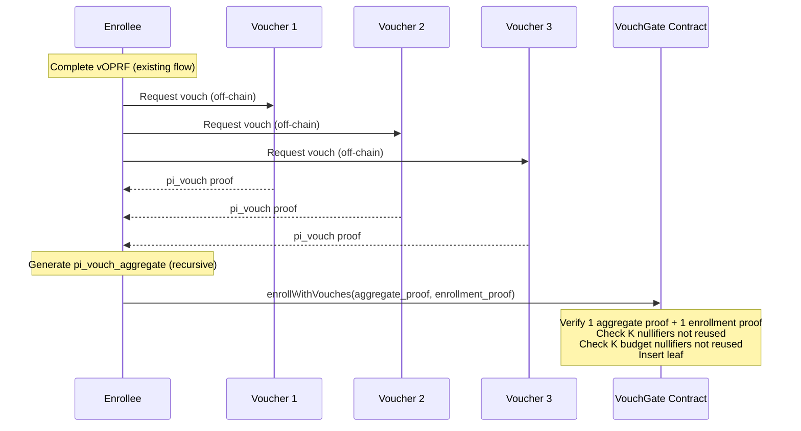

# Resilient Private Identity

> **Status:** Complete
> **Privacy Primitive:** Anonymous credentials with issuer-independent verification

## Overview

Demonstrates an identity protocol where holders enroll once using existing identity proofs (ZK Email, ZKPassport, Anon Aadhaar, TLSNotary) and a threshold vOPRF network, then prove attributes (age, nationality) via ZK membership proofs against an on-chain Merkle root, with no issuer involvement after enrollment.

The core idea: anchor enrollment to a verifiable oblivious pseudorandom function (vOPRF) that binds one real-world identity to one on-chain leaf, providing cryptographic sybil resistance. The on-chain Merkle root is the sole trust anchor. If the issuer disappears, holders keep proving.

## Cryptographic Assumptions

- **Primitives used:** Poseidon hash (BN254 scalar field), UltraHonk (Barretenberg v0.82.0), vOPRF (RFC 9497 extended), Fouque-Tibouchi SVDW hash-to-curve (RFC 9380), incremental Merkle tree (@zk-kit/imt v2.1.0), DLEQ (Chaum-Pedersen) proofs
- **Security assumptions:** BN254 discrete log hardness (~100-110 bits classical security), UltraHonk soundness, honest MPC threshold (4-of-7)
- **Trusted setup:** Universal SRS (Aztec Ignition ceremony, 2^20 points). No per-circuit trusted setup.

## Threat Model

The adversary is a single issuer who cooperated during initial credential issuance but has since become adversarial. The adversary can refuse new issuance, mass-revoke credentials, publish false revocation lists, attempt de-anonymization, or forge credentials for non-holders. Verifiers are honest-but-curious. The vOPRF MPC network is honest above its threshold.

What this protects against:
- Public observers cannot learn holder identity from membership proofs
- Verifiers cannot link proofs across different application scopes
- A failed or adversarial issuer cannot revoke the ability to prove attributes
- Duplicate enrollment by the same real-world identity is rejected on-chain

What this does NOT protect against:
- Compromise of t or more MPC nodes (enables sybil bypass and enrollment enumeration)
- Verifier collusion with the issuer
- Transaction graph linkability without relayer infrastructure
- Key loss (no revocation mechanism in the PoC)
- BN254 security margin below 128-bit target
- Self-declared attributes (not verified on-chain; see Future Work below)

## Prerequisites

- [Rust](https://www.rust-lang.org/tools/install)
- [Foundry](https://getfoundry.sh/introduction/installation)
- [Nargo](https://noir-lang.org/docs/getting_started/noir_installation) v1.0.0-beta.3
- [Barretenberg](https://barretenberg.aztec.network/docs/getting_started) v0.82.0

## Installation

```bash
cd pocs/private-identity/resilient-private-identity
# Install Solidity dependencies
forge soldeer install
```

## Building

```bash
nargo compile --workspace
forge build
cargo check
```

## Running

```bash
cargo test
```

## Tests

```bash
nargo test --workspace
forge test
cargo test --lib
```

## Known Limitations

- **Key loss is permanent.** No revocation mechanism. If a holder loses `identity_secret`, the leaf remains and the enrollment nullifier stays consumed.
- **Self-declared attributes.** Enrollees self-declare their attribute vector. The protocol does not validate attribute truthfulness on-chain, future work describes a design for verifying canonical identity sources during enrolment.
- **Predicate parameter leakage.** `predicate_type`, `predicate_attr_index`, `predicate_value`, and `predicate_result` are public inputs visible on-chain. With 2 queryable dimensions, the anonymity set ceiling is ~498 buckets.
- **Transaction graph linkability.** Without a relayer, the Ethereum transaction graph links enrollment to verification via address reuse or funding-source correlation.
- **No forward secrecy.** `identity_secret` is static and never rotates. Compromise reveals all historical nullifiers.
- **MPC metadata accumulation.** Each MPC node sees `(identity_commitment, blinded_request, IP, timestamp)` per enrollment.
- **BN254 security margin.** ~100-110 bits classical security, below the 128-bit target. Driven by Ethereum precompile availability.
- **Single-chain.** No L2 deployment or cross-chain root bridging.

See [SPEC.md](./SPEC.md) for the full limitations table with mitigations.

## Future Work: Multi-Source Identity Integration

This section describes a production extension for integrating existing identity proof systems (Anon Aadhaar, ZKPassport, OpenAC, ZK Email) as enrollment sources. The PoC restricts enrollment to a single identity source type per deployment.

### Motivation

The PoC treats `user_id` canonicalization as an external process: the enrollee derives a canonical identifier from their identity proof, and the MPC network accepts it on trust. This has two limitations. First, the binding between the identity proof and the vOPRF input is not cryptographically enforced. Second, different identity sources produce different canonical identifiers for the same person, so a person holding both an Aadhaar card and a passport could enroll twice.

### Design Overview

The extension replaces the current single-source `pi_link` circuit with a family of per-source circuit variants. Each variant recursively verifies a source-specific identity proof inside the circuit, extracts verified biographic fields from the proof's public outputs, and derives `user_id_hash` from those fields. The enrollment circuit, membership circuit, on-chain contracts, and vOPRF protocol are unchanged.

The vOPRF remains essential. Without the keyed PRF layer, enrollment nullifiers would be deterministic hashes of biographic fields that are publicly available through data breaches, social media, and public records. The vOPRF ensures that the mapping from identity to enrollment nullifier requires the MPC threshold key, providing enumeration resistance.

### Tiered Canonical Identity

- **Tier 1 (Government ID):** Sources that attest to a full legal name and date of birth (Anon Aadhaar, ZKPassport). The canonical person identifier is derived from shared biographic fields, providing cross-source sybil resistance within the tier.
- **Tier 2 (Web2):** Sources that attest to a digital account (email, TLS session) but lack biographic fields. Sybil resistance only within the same source type.

### Per-Source Link Proof Circuits

Each identity source defines a `pi_link` circuit variant that recursively verifies the source proof, extracts biographic fields, and derives `G_id`. All variants share the same public input interface, so the MPC network and enrollment circuit require no per-source modifications.

This also resolves the self-declared attribute limitation: per-source circuits can extract verified attributes from the source proof and constrain them to match the values committed in the enrollment leaf.

### Recursive Proof Feasibility

Recursive verification of existing identity proof systems (Groth16 on BN254) inside Noir is expensive but feasible. Estimated 1M-5M constraints per source verifier. This cost is borne by the prover at enrollment time and does not affect membership proof generation or on-chain verification gas costs.

See [SPEC.md](./SPEC.md) for the full future work specification including name normalization, MPC implications, and detailed circuit constraints.

## Future Work: Web of Trust

### Problem

The vOPRF sybil gate binds one identity source credential to one on-chain leaf. But if the identity source itself is compromised (unlimited burner emails, forged documents), an attacker can generate T fake source identities that each pass the vOPRF legitimately. The cryptographic gate holds (one source identity, one leaf) but the source is a mint.

The refundable enrollment stake (see [SPEC.md: Sybil Resistance Model](./SPEC.md#sybil-resistance-model)) provides a second gate: each fake leaf requires locked capital. But for well-funded adversaries, capital lockup alone is insufficient. A social gate complements both layers.

### Design: Off-Chain Recursive Vouch Aggregation

A second sybil gate layers social trust on top of the vOPRF. Before enrollment, the enrollee must collect K=3 vouches from existing tree members. Vouches are generated off-chain and aggregated into a single recursive proof, submitted atomically with the enrollment transaction.



**Key properties:**

- **No on-chain vouch graph.** All vouch activity is off-chain. The single enrollment TX is indistinguishable from a non-vouched enrollment except for the K nullifier checks. No timing trail, no vouch counter, no social graph leakage.
- **Bounded sybil amplification.** Each member has a lifetime vouch budget of V=2 (enforced via budget nullifiers). Since V < K, an attacker with T fake identities creates at most TV/(K-V) = 2T additional sybils. Total: 3T. Growth is linear and bounded.
- **Constant on-chain cost.** The recursive proof aggregates K inner proofs into one. On-chain verification is 2 proof checks (aggregate + enrollment) regardless of K, plus K nullifier lookups.
- **Cross-chain replay prevention.** `chain_id` is a public input constrained in both the inner and outer circuits.
- **Censorship resistance.** Governance multisig can force-enroll via `governanceEnroll()` to prevent vouch cartels from blocking legitimate enrollees.
- **Bootstrap.** First N members enroll without vouches (bootstrap phase), after which the vouch requirement activates irreversibly.

**New circuits:** `pi_vouch` (prove tree membership + produce vouch and budget nullifiers) and `pi_vouch_aggregate` (recursively verify K=3 inner proofs, enforce distinctness).

**New domain tags:** `DOMAIN_VOUCH = 9`, `DOMAIN_VOUCH_BUDGET = 10`.

## References

- [Resilient Private Identity SPEC](./SPEC.md)
- [Private Identity Requirements](../REQUIREMENTS.md)
- [Private Identity Use Case (ethsystems/map)](https://github.com/ethsystems/map/blob/master/use-cases/private-identity.md)
- [Private Identity Approach (ethsystems/map)](https://github.com/ethsystems/map/blob/master/approaches/approach-private-identity.md)
- [Semaphore Protocol](https://semaphore.pse.dev/)
- [RFC 9497: Oblivious Pseudorandom Functions](https://www.rfc-editor.org/rfc/rfc9497)
- [zk-creds (Rosenberg et al., 2023)](https://eprint.iacr.org/2022/878)
