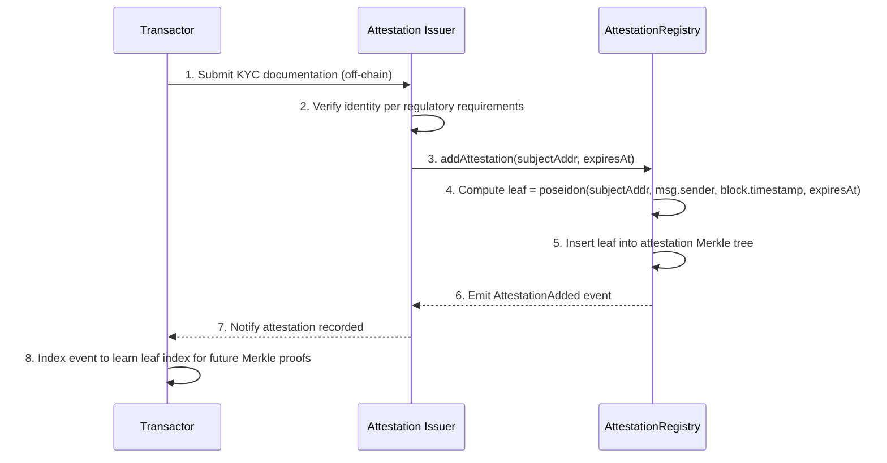
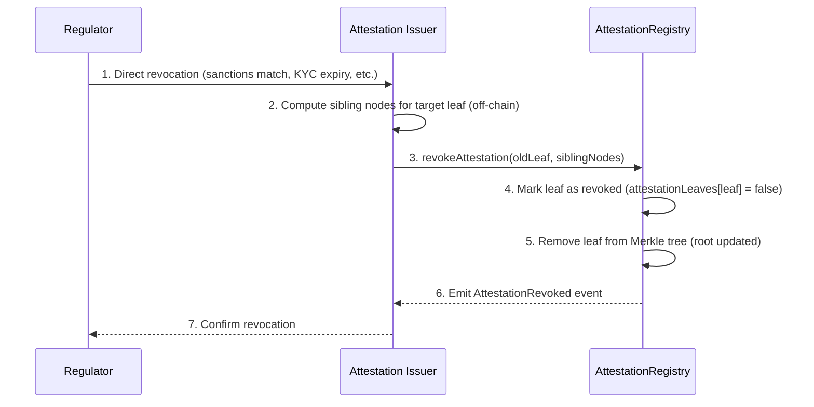
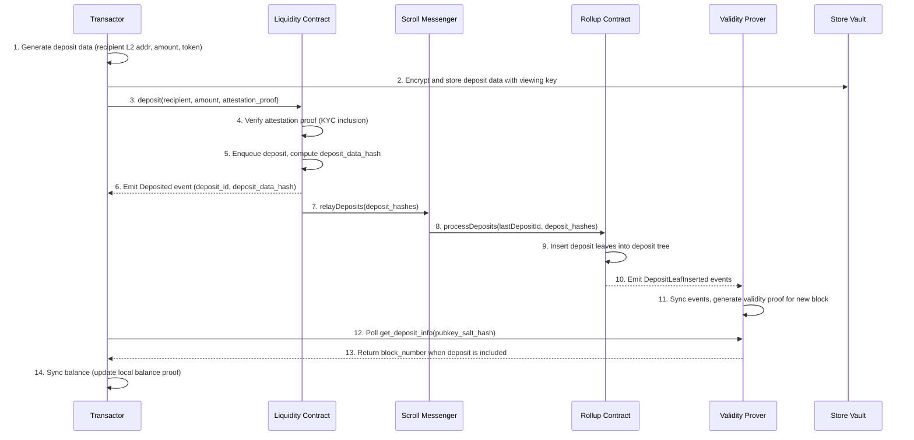
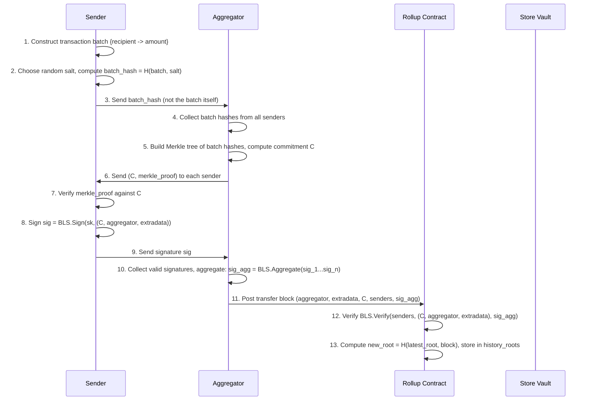
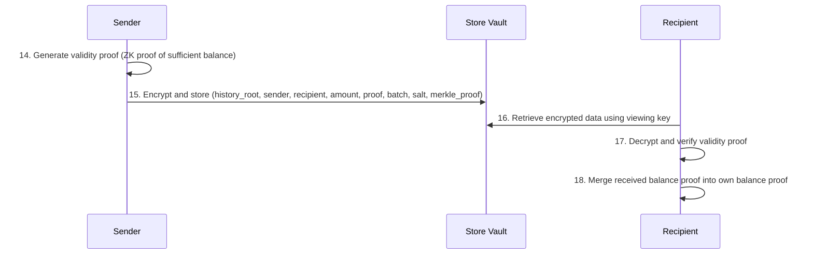
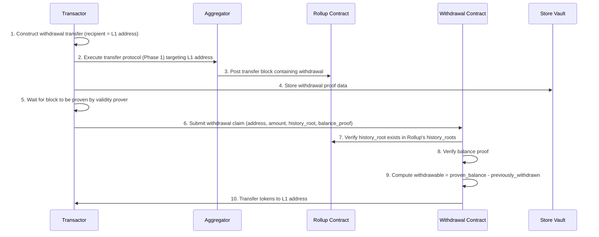

# Plasma Private Payments: Protocol Specification

## Executive Summary

This specification describes how to deploy and configure a private payment system using the [Intmax2](https://eprint.iacr.org/2025/021) stateless ZK-plasma. The core plasma protocol (block production, signature aggregation, balance proofs, withdrawal mechanics) is defined by the Intmax2 paper and is not re-specified here. This document focuses on:

1. **Deployment models**: How institutions can use the system, either by deploying a private Intmax2 instance or by using the public Intmax network.
2. **Attestation-gated entry**: How KYC verification is enforced at the deposit layer via zero-knowledge proofs against an on-chain attestation registry. This is the main protocol addition on top of Intmax2.
3. **Operational configuration**: Key derivation, contract layout, service topology, and compliance integration.

> [!NOTE]
> Intmax2 designates its plasma contracts as “Rollup” contracts; this specification uses plasma terminology for architectural clarity while preserving those original names for consistency with the reference implementation.

Privacy is achieved architecturally: transaction details never appear on-chain. The Rollup contract stores only block commitments (Merkle roots of salted transaction batch hashes) and aggregated BLS signatures. Users maintain their own balance proofs client-side via recursive ZK proofs. A dual-key architecture (spending key for transfers, viewing key for audits) enables selective regulatory disclosure without compromising spending authority.

## Problem Statement

Institutional payment flows on public blockchains expose sensitive operational data:

- **Treasury operations**: Visible cash positions and movement patterns
- **Supplier relationships**: Payment destinations reveal business relationships
- **Settlement patterns**: Timing and frequency expose trading strategies
- **Competitive intelligence**: Aggregated on-chain data enables competitor analysis

Institutions need private payment rails that satisfy AML/KYC requirements. Two paths exist: deploy a dedicated private instance with custom compliance rules, or use the public Intmax network under Intmax's compliance framework.

### Constraints

| Category | Requirement |
|----------|-------------|
| **Privacy** | Transaction amounts, counterparties, and patterns hidden from public observers. Transaction *existence* may be visible (block commitments are public), but contents are not. |
| **Regulatory** | Only KYC-verified participants can deposit. Viewing keys enable selective disclosure for AML/CFT monitoring. |
| **Operational** | Near real-time settlement. Compatible with existing ERC-20 stablecoins and native ETH. On-chain data scales with number of *senders* per block, not number of transactions. |
| **Trust** | Aggregators cannot steal funds, link transactions, or censor selectively. No centralized sequencer. Permissionless aggregation. |

## Approach

### Strategy

Two deployment models are supported:

**Private deployment**: An institution deploys its own Intmax2 plasma contracts, block builder(s), and supporting services. It uses an existing token on L1 (e.g., USDC) and controls the full stack, including which compliance authorities are authorized to issue attestations, what KYC requirements apply, attestation expiry policy, and revocation procedures. Examples include a single bank for internal treasury operations, a consortium for interbank settlement, or a payment network operator for merchant payments.

**Public network**: An institution's customers use the public Intmax deployment. AML permitter rules are set by Intmax (the network operator); individual institutions cannot configure their own attestation rules. The institution's role is limited to ensuring its customers are attested under Intmax's compliance framework before they deposit.

In both models:
- Attestation gating controls who can deposit into the plasma chain
- Transactions are private by architecture: only commitments on-chain
- Customers bridge tokens into the plasma chain for private transfers, and withdraw back to L1

### Why This Approach

Starting from the constraints:

1. **Transaction privacy** requires that transaction details (amounts, recipients) are not posted on-chain. This rules out optimistic rollups, where full transaction data is published to L1 for data availability.
2. **No trusted sequencer** requires stateless block production, where aggregators do not need to know the previous plasma state to produce new blocks. This rules out designs where a single sequencer maintains global state.
3. Together, (1) and (2) point to an architecture where only *commitments* (Merkle roots of salted transaction hashes) go on-chain, and users maintain their own balance state.
4. **Compliance gating** is layered on top via attestation-gated deposits, orthogonal to the plasma design itself.

Shielded pools (UTXO commitments and nullifiers on L1) satisfy transaction privacy but post every state transition on-chain, limiting scalability.
FHE-based payments offer flexible encrypted computation but carry higher costs and less mature tooling.
The stateless ZK-plasma satisfies all four constraints, at the cost of pushing proof generation to clients and relying on a newer, less battle-tested protocol.

### Tools & Primitives

We use [Intmax2](https://eprint.iacr.org/2025/021) as the concrete instantiation of the above architecture. It is the most mature implementation of a stateless ZK-plasma with permissionless aggregation, client-side balance proofs, and minimal on-chain data. The protocol's fund safety property has been formally verified in the Lean theorem prover.

| Tool | Purpose |
|------|---------|
| **BLS Signatures** | Aggregatable signatures for block commitment signing; compact on-chain representation of sender consent |
| **Plonky2** | Recursive ZK proof system (FRI-based, no trusted setup) for balance proofs and validity proofs |
| **Poseidon Hash** | ZK-friendly hash function for Merkle trees, transaction batch hashing, and attestation leaves |
| **Sparse Merkle Trees** | Authenticated dictionary for transaction batch commitments (binding property ensures security) |
| **Solidity** | On-chain contracts: Rollup, Liquidity, Withdrawal, BlockBuilderRegistry, AttestationRegistry |

## Protocol Design

### Participants & Roles

| Role | Description | Keys Held |
|------|-------------|-----------|
| **Deployer / Operator** | Entity that deploys and configures the plasma contracts and services. In a private deployment, this is the institution. On the public network, this is Intmax. | L1 deployer key |
| **Transactor** | End-user performing deposits, transfers, and withdrawals | BLS keypair (L2 spending), ETH keypair (L1), Viewing key |
| **Aggregator (Block Builder)** | Collects transaction batch hashes, constructs Merkle trees, aggregates BLS signatures, posts transfer blocks to Rollup contract. Stateless and permissionless. | L1 signing key |
| **Validity Prover** | Observes on-chain events, generates validity proofs for posted blocks via recursive ZK circuits | None (stateless service) |
| **Store Vault Server** | Stores encrypted transaction data for clients to retrieve and decrypt with their viewing key | None (untrusted storage) |
| **Attestation Issuer** | Issues KYC attestations to verified participants, stored in on-chain attestation tree | Attestation signing key (ETH account) |
| **Regulator** | Observer granted viewing keys by transactors for audit purposes | Granted viewing keys |

### Key Derivation

```
spending_key  = random(Zq)                    // BLS secret key
spending_pubkey = g1^spending_key in G1        // BLS public key = L2 address
viewing_key   = random()                       // Separate key for decrypting stored data
```

- **L2 address**: The BLS public key uniquely identifies the user on the plasma chain.
- **Spending authority**: The BLS secret key signs block commitments during the transfer protocol and is used to generate balance proofs. Only the spending key holder can authorize transfers or withdrawals.
- **Viewing key**: Decrypts deposit, transfer, and withdrawal data stored in the store vault server. Grants read-only audit access without spending authority. Institutions should manage viewing key distribution carefully, potentially using threshold schemes for regulator access in production.

**Security note**: Compromise of the spending key allows unauthorized transfers. Compromise of the viewing key reveals full transaction history but does not enable theft.

### Data Structures

> The following structures are defined by the Intmax2 protocol ([paper](https://eprint.iacr.org/2025/021), Sections 2.3-2.7). They are summarized here to establish the vocabulary used in the rest of this spec.

#### Transaction Batch

A transaction batch is a mapping from recipients to amounts, representing all payments a sender wants to make in a single block:

```
TransactionBatch = { recipient -> amount }

where:
  recipient in K = K1 + K2    // L1 address or L2 address
  amount    in V+              // Positive value (supports multi-token)
```

A sender can include an arbitrary number of recipients in a single batch. The batch is hashed with a random salt before being sent to the aggregator:

```
batch_hash = H(transaction_batch, salt)
```

#### Transfer Block

The on-chain record of a set of transactions. Contains only commitments and signatures:

```
TransferBlock {
    aggregator:   address     // L1 address of the aggregator
    extradata:    bytes       // Replay/timing protection (e.g., deadline)
    commitment:   bytes32     // Merkle root of all transaction batch hashes
    senders:      address[]   // L2 addresses (BLS public keys) of senders
    signature:    bytes       // Aggregated BLS signature over (commitment, aggregator, extradata)
}
```

On-chain size: `|senders| * 96 + 132` bytes (uncompressed). With ID-based sender compression: `|senders| * ~4 + 132` bytes.

#### Deposit Block

Records a single deposit from L1 to L2:

```
DepositBlock {
    recipient:    address     // L2 address (BLS public key) of the recipient
    amount:       uint256     // Deposited value
    token_index:  uint32      // Index of the deposited token type
}
```

#### Balance Proof

Client-side data structure that enables a user to prove their balance:

```
BalanceProof = Dict(
    (commitment, sender) -> ((merkle_proof, salt), transaction_batch)
)
```

A balance proof is valid if every entry's Merkle proof verifies against the corresponding block commitment. Users update their balance proof by adding their own sent transactions and merging balance proofs received from senders.

For the formal definition and the balance computation function `Bal`, see the Intmax2 paper, Appendix B.

#### Validity Proof

A recursive ZK proof attesting that a sender had sufficient balance for a transaction:

```
ValidityProof {
    history_root:   bytes32   // History root of the plasma block containing the transaction
    sender:         address   // L2 address of the sender
    recipient:      address   // L2 or L1 address of the recipient
    amount:         uint256   // Transaction amount
    proof:          bytes     // ZK proof (Plonky2)
}
```

The recipient only learns the specific transaction details and gains zero knowledge about the sender's balance or other transactions.

### Attestation-Gated Entry

Before a transactor can deposit funds, they must be attested by an authorized attestation issuer. This is the compliance integration layer on top of Intmax2.

#### Attestation Registry Contract

The attestation registry maintains a Merkle tree of KYC attestation leaves:

```solidity
contract AttestationRegistry {
    // Merkle tree of attestation leaves
    MerkleTree internal _tree;

    // Mapping of attestation leaf hash to existence status
    mapping(bytes32 => bool) public attestationLeaves;

    // Authorized attesters (compliance authorities)
    mapping(address => bool) public authorizedAttesters;

    event AttestationAdded(bytes32 indexed leaf, bytes32 indexed subjectAddr,
                           address indexed attester, uint64 issuedAt, uint64 expiresAt);
    event AttestationRevoked(bytes32 indexed leaf, address indexed revokedBy);
}
```

In a private deployment, the deploying institution controls which attesters are authorized. On the public network, Intmax controls this.

#### Attestation Leaf

```
AttestationLeaf {
    subject_addr:     address   // L2 address (BLS public key hash) of attested party
    attester:         address   // Attestation issuer L1 address
    issued_at:        uint64    // Timestamp of attestation issuance
    expires_at:       uint64    // Expiration timestamp (0 = no expiry)
}

leaf_hash = poseidon(subject_addr, attester, issued_at, expires_at)
```

#### Attestation Issuance (KYC Onboarding)



**Prerequisites**: The Attestation Issuer must be registered as an authorized attester by the contract owner via `addAttester(address)`.

#### Attestation Revocation

When a participant's KYC expires, they become sanctioned, or a regulator directs removal:



After revocation, the participant can no longer produce valid Merkle inclusion proofs against the updated attestation root, preventing new deposits. Funds already in the plasma chain remain spendable; the protocol does not freeze in-flight funds.

#### Deposit Attestation Proof

The Liquidity contract MUST verify a ZK proof of attestation inclusion before accepting any deposit. The proof demonstrates:

1. The depositor's L2 address exists as a leaf in the attestation tree
2. The attestation has not expired (or has no expiry)
3. The proof is valid against the current attestation tree root

This is verified without revealing *which* attestation leaf was used, preserving the depositor's privacy within the set of all attested participants.

### On-Chain State

#### Intmax2 Contracts

The following contracts are defined by the Intmax2 protocol. See the [paper](https://eprint.iacr.org/2025/021), Section 2 for full specifications.

**Rollup Contract** (deployed on L2, e.g., Scroll): Stores the hash chain of block commitments (`history_roots`), the deposit Merkle tree, and cumulative withdrawal amounts per L1 address. Verifies aggregated BLS signatures for transfer blocks. Accepts deposit relay calls only from the cross-chain messenger authenticated as the Liquidity contract (`onlyLiquidityContract` modifier).

**Liquidity Contract** (deployed on L1 or L2): Accepts deposits (native ETH or ERC-20), maintains a 1-indexed deposit queue, and relays deposit data to the Rollup contract via the cross-chain messenger. This is where the attestation proof verification integrates: the contract references an `aml_permitter` address that verifies the depositor's attestation proof before accepting the deposit.

**Block Builder Registry**: Tracks registered block builders with their stake, heartbeat timestamps, and API endpoints. Provides a discovery mechanism for clients to find active builders.

**Withdrawal Contract**: Processes withdrawal claims by verifying that the claimed history root exists in the Rollup contract, verifying the ZK balance proof, computing withdrawable amounts (proven balance minus previously withdrawn), and transferring tokens.

#### Attestation Integration

The attestation layer adds one contract and one integration point:

- **AttestationRegistry**: Described in the Attestation-Gated Entry section above.
- **Liquidity contract integration**: The Liquidity contract's `aml_permitter` field references the attestation verification logic. On deposit, it calls the permitter to verify the ZK proof of attestation inclusion before enqueuing the deposit.

### Flows

#### Deposit

Converts public tokens into a private L2 balance. Requires proof of KYC attestation.



**Steps**:

1. Transactor prepares deposit data: recipient L2 address, deposit amount, token index
2. Transactor encrypts deposit metadata and stores it in the store vault server (retrievable via viewing key)
3. Transactor calls `deposit()` on the Liquidity contract with the deposit amount and a ZK proof of attestation inclusion
4. Liquidity contract verifies the attestation proof against the current attestation tree root
5. Liquidity contract enqueues the deposit and computes a deposit data hash
6. Liquidity contract emits a `Deposited` event with the deposit ID and hash
7. Deposits are relayed from L1/L2 to the plasma chain via the cross-chain messenger
8. The messenger calls `processDeposits()` on the Rollup contract (authenticated via `onlyLiquidityContract` modifier)
9. Rollup inserts deposit leaves into its deposit Merkle tree
10. Rollup emits `DepositLeafInserted` events
11. The validity prover observes these events, syncs witnesses, and generates a validity proof for the new block state
12. Client polls the validity prover until the deposit is confirmed
13. Validity prover returns the block number containing the deposit
14. Client updates their local balance proof to include the deposit

#### Private Transfer

Transfers value between L2 accounts. The transfer protocol follows the Intmax2 design ([paper](https://eprint.iacr.org/2025/021), Section 2.6) and is described here for completeness.

##### Phase 1: Block Construction



**Key privacy property**: The aggregator receives only salted hashes of transaction batches (step 3). The aggregator cannot determine who is paying whom or how much.

##### Phase 2: Balance Proof Distribution



**Steps**:

14. After the transfer block is posted on-chain, the sender generates a validity proof: a recursive ZK proof attesting that the sender had sufficient balance at the given history root
15. The sender encrypts the transaction data (including the validity proof, transaction batch, salt, and Merkle proof from the aggregator) and stores it in the store vault server
16. The recipient retrieves the encrypted data from the store vault using their viewing key
17. The recipient decrypts and verifies the validity proof. The proof reveals only the specific transaction details (sender, recipient, amount)
18. The recipient merges the received balance proof into their own

**Zero-knowledge property**: The recipient learns only `(history_root, sender, recipient, amount)` for their specific transaction. They gain zero knowledge about the sender's total balance, other transactions in the same block, or any other user's activity.

#### Withdrawal

Converts a private L2 balance back to public L1 tokens. Withdrawal is a two-step process: first a transfer to an L1 address within the plasma chain, then a claim on L1.



**Steps**:

1. Transactor constructs a transaction batch with the recipient set to an L1 address (indicating withdrawal intent)
2. The transaction goes through the standard transfer protocol (Phase 1: block construction with aggregator)
3. The aggregator posts the transfer block to the Rollup contract
4. Transactor stores withdrawal proof data in the store vault
5. Transactor waits for the validity prover to generate a proof for the block containing the withdrawal
6. Transactor submits a withdrawal claim to the Withdrawal contract
7. The Withdrawal contract verifies that the history root exists in the Rollup contract
8. The contract verifies the balance proof
9. The contract computes the withdrawable amount: `withdrawable = proven_balance - withdrawn[address]`
10. The contract transfers the withdrawable amount to the L1 address

**Double-spend prevention**: The `withdrawn` mapping tracks cumulative withdrawals per L1 address. Even if a user submits multiple withdrawal claims using different history roots, the total withdrawn amount is always deducted.

## Cryptographic Details

### Primitives

| Primitive | Specification | Usage |
|-----------|---------------|-------|
| **Signature Aggregation** | Modified BLS (Boneh-Drijvers-Neven, rogue-key protection) | Block commitment signing; compact on-chain representation |
| **Hash Function** | Poseidon (BN254 scalar field) | Merkle trees, transaction batch hashing, attestation leaves |
| **Authenticated Dictionary** | Sparse Merkle Tree | Transaction batch commitments (binding property ensures security) |
| **ZK Proof System** | Plonky2 (recursive, FRI-based, no trusted setup) | Balance proofs, validity proofs |
| **Collision-Resistant Hash** | `H: {0,1}* -> {0,1}^n` | Block history chain (`new_root = H(latest_root, block)`) |
| **Encryption** | ECIES / AEAD | Store vault encryption (viewing key decryption) |

### BLS Signature Scheme

The protocol uses a modified BLS signature scheme with rogue-key protection (Boneh-Drijvers-Neven):

- **KeyGen**: `sk <- random(Zq)`, `pk <- g1^sk in G1`
- **Sign**: `sig <- H0(m)^sk in G0`
- **Aggregate**: `sig_agg <- Product(sig_i^t_i)` where `t_i = H1(pk_i, {pk_1,...,pk_n})`
- **Verify**: Check `e(g1, sig_agg) == e(pk_agg, H0(m))` where `pk_agg = Product(pk_i^t_i)`

The rogue-key mitigation factor `t_i` prevents an adversary from constructing a public key that cancels out honest signers' contributions. For full details, see the Intmax2 paper, Section 2.5, and the [Boneh-Drijvers-Neven paper](https://doi.org/10.1007/978-3-030-03329-3_15).

### Balance Proof Computation

Given a balance proof and the current plasma state, the balance function `Bal` computes account balances in two steps:

1. **Extract partial transactions**: For each block, extract transactions from the balance proof. For deposit blocks, extract the deposit amount. For transfer blocks, look up the sender's transaction batch. If the balance proof does not contain an entry for a sender in a transfer block, the transaction amount is treated as unknown.

2. **Apply transition function**: Starting from zero balances, apply each partial transaction sequentially. For known amounts, transfer the minimum of the stated amount and the sender's current balance. For unknown amounts, set the sender's balance to zero (conservative lower bound).

This produces a lower bound on each account's true balance. Unknown transactions can only reduce a sender's provable balance, never inflate anyone's balance beyond what can be proven.

For the formal definition, see the Intmax2 paper, Appendix B.

### Validity Proof Pipeline

The validity prover service maintains a continuous pipeline:

1. **Event observation**: Monitors L1/L2 for `Deposited`, `DepositLeafInserted`, and `BlockPosted` events
2. **Witness construction**: Processes observed events into structured witness data
3. **Proof generation**: Dispatches proof tasks to a worker pool (via task queue). Each task produces a Plonky2 proof attesting to the validity of a block transition
4. **Proof availability**: Completed proofs are stored and made available to block builders (who wait for validity prover sync before posting new blocks) and to clients (who poll for proof availability to confirm deposits and transfers)

## Security Model

### Threat Model

| Adversary | Capabilities | Mitigations |
|-----------|--------------|-------------|
| **Public Observer** | Sees all on-chain data: block commitments, sender lists (BLS public keys), deposit amounts, withdrawal amounts | Transaction details (recipient, amount per recipient) never posted on-chain; observer sees only Merkle roots and aggregated signatures |
| **Malicious Aggregator** | Can delay block publication, attempt replay attacks, selectively censor senders, or refuse to relay Merkle proofs | Relayer contracts enforce deadlines (extradata field); aggregation is permissionless; users can switch aggregators or run their own; replay protection via monotonic timestamps |
| **Compromised Recipient** | Receives sender's validity proof for their specific transaction | Zero-knowledge: validity proof reveals only `(sender, recipient, amount)` for that transaction; no information about sender's balance or other transactions |
| **Colluding Aggregator + Recipient** | Aggregator knows sender's BLS public key; recipient knows transaction amount | Aggregator only sees salted hash of transaction batch, not contents; cannot link sender identity to specific payment amounts or recipients |
| **Compromised Viewing Key** | Can decrypt all historical and future transaction data for that key from the store vault server | Cannot spend funds; viewing key grants read-only access; key rotation recommended |
| **Malicious Store Vault Operator** | Learns viewing public key (stable identifier) on every request; observes which topics are accessed, request timing, frequency, and data digests queried; can correlate activity patterns across sessions; data is encrypted client-side (BLS encryption) so content is opaque, but metadata is fully visible | Client-side BLS encryption protects data confidentiality; all topics enforce AuthRead so only the key holder can read their own data; no PIR is employed: the server learns **who** is accessing **which** topic and **when**, but not the plaintext content; production should consider PIR or oblivious access patterns to reduce metadata leakage, or operating the service exclusively within your own organization |
| **Network Observer** | Monitors IP addresses, timing of requests to aggregators and store vault | Out of scope for PoC; production should use Tor/mixnet for client-aggregator communication |

### Guarantees

| Property | Description |
|----------|-------------|
| **Confidentiality** | Transaction details (amounts, recipients per sender) never posted on-chain. Only block commitments and sender lists are stored. |
| **Unlinkability** | Aggregator receives only salted hashes of transaction batches. Cannot determine who is paying whom or how much within a block. |
| **Double-Spend Prevention** | The balance function computes conservative lower bounds. Withdrawals deduct from proven balances via the `withdrawn` mapping. Formally proven secure (Theorem 1). |
| **Compliance Gating** | Attestation proof required at deposit. Unauthorized parties cannot enter the system. Revocation prevents future deposits but does not freeze in-flight funds. |
| **Selective Disclosure** | Viewing key decrypts deposit, transfer, and withdrawal data from the store vault. Enables regulatory audit of a specific transactor's full history without compromising spending authority or other users' privacy. |
| **Liveness** | Permissionless aggregation: anyone can become an aggregator. Users can withdraw even if all aggregators disappear (by running their own aggregator or submitting balance proofs directly). |
| **Fund Safety** | Formally verified in Lean: the Rollup contract balance is always non-negative for any valid execution trace. |
| **Sender Privacy from Aggregator** | The aggregator learns only the set of sender public keys and salted transaction hashes. Transaction contents are hidden. |

### Limitations & Shortcuts (PoC Scope)

| Limitation | Impact | Production Mitigation |
|------------|--------|----------------------|
| **No attestation contract in PoC** | Deposits are not KYC-gated in the current implementation | Deploy AML permitter contract with on-chain attestation tree; integrate proof verification into Liquidity contract |
| **Viewing key shares full transaction history** | Compromised viewing key permanently leaks all historical data for that user | Implement key rotation with historical cutoff; time-bounded viewing keys |
| **Client-side proof generation** | Computationally intensive (Plonky2 recursive proofs); impractical for light clients | Delegated proof generation services; zkSaaS providers |

## Terminology

| Term | Definition |
|------|------------|
| **Transaction Batch** | A mapping from recipients to amounts, representing all payments a sender makes in a single block. Hashed with a random salt before submission to the aggregator. |
| **Transfer Block** | The on-chain record of a set of transactions: contains a Merkle root of transaction batch hashes, the set of sender public keys, and an aggregated BLS signature. |
| **Deposit Block** | An on-chain record of a deposit from L1/L2 into the plasma chain, specifying the recipient L2 address and amount. |
| **Balance Proof** | A client-side data structure mapping block commitments and senders to their transaction batches with Merkle proofs. Used to prove account balances. |
| **Validity Proof** | A recursive ZK proof (Plonky2) attesting that a sender had sufficient balance for a specific transaction at a given history root. Sent to the recipient as proof of payment. |
| **History Root** | A hash in the Rollup contract's hash chain of block commitments. Each new block extends the chain: `new_root = H(previous_root, block)`. Used as an anchor for balance and withdrawal proofs. |
| **Aggregator (Block Builder)** | An entity that collects transaction batch hashes, builds a Merkle tree, aggregates BLS signatures, and posts the resulting transfer block to the Rollup contract. Stateless and permissionless. |
| **Authenticated Dictionary** | A cryptographic data structure (sparse Merkle tree) that commits to a set of key-value pairs with lookup proofs. The binding property ensures no two different values can be proven for the same key under the same commitment. |
| **Attestation** | A signed statement from an attestation issuer that an L2 address belongs to a KYC-verified entity, stored as a leaf in the on-chain attestation Merkle tree. |
| **Store Vault** | An untrusted server that stores encrypted transaction data. Clients encrypt data with recipients' viewing keys before upload. The server cannot read the contents. |
| **Viewing Key** | A cryptographic key that decrypts transaction data stored in the store vault. Grants read-only access to a user's deposit, transfer, and withdrawal history without spending authority. |
| **Spending Key** | The BLS secret key that authorizes transfers and withdrawals. Required to sign block commitments and generate balance proofs. |
| **Scroll Messenger** | The cross-chain messaging contract that relays deposit data from the Liquidity contract to the Rollup contract, ensuring the `onlyLiquidityContract` modifier is satisfied. |

## References

- [Intmax2: A ZK-rollup with Minimal Onchain Data and Computation Costs Featuring Decentralized Aggregators](https://eprint.iacr.org/2025/021): Rybakken, Hioki, Yaksetig, Diaconescu, Silváši, Sutherland. Core protocol design, security proof (Theorem 1, formally verified in Lean).
- [EthSystems Map: Private Payments Use Case](https://github.com/ethsystems/map/blob/master/use-cases/private-payments.md): Business requirements and institutional constraints.
- [EthSystems Map: Private Payments Approach](https://github.com/ethsystems/map/blob/master/approaches/approach-private-payments.md): Architecture recommendations and trade-off analysis.
- [Compact Multi-Signatures for Smaller Blockchains](https://doi.org/10.1007/978-3-030-03329-3_15): Boneh, Drijvers, Neven (2018). Modified BLS signature scheme with rogue-key protection.
- [Plonky2](https://github.com/0xPolygonZero/plonky2): Recursive ZK proof system (FRI-based) used for balance and validity proofs.
- [Poseidon Hash Function](https://www.poseidon-hash.info/): ZK-friendly hash for Merkle trees and commitments.
- [Plasma Prime Design Proposal](https://ethresear.ch/t/plasma-prime-design-proposal/4222): Predecessor design incorporating RSA accumulators and UTXO model.
