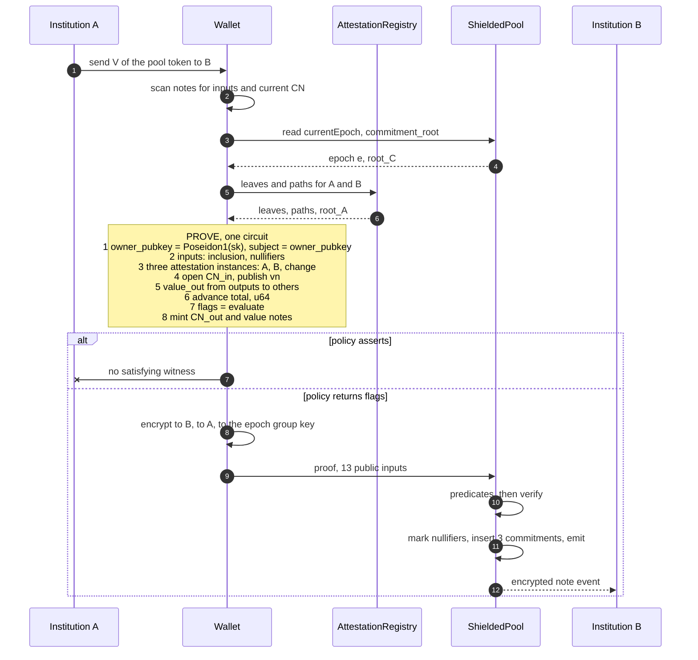

# Shielded Pool: Verifiable-Coverage Continuous Monitoring

## Overview

This document extends the parent [shielded-pool](../shielded-pool/SPEC.md).

**Coverage.** The compliance policy is a function compiled into the same circuit that conserves value. It reads a `TxFacts` record the pool constrains, and it blocks a transaction by leaving it without a satisfying witness. Value reaches a party-chosen destination only after the policy has run. The blocked-funds exit of [Flows](#flows) is excepted, and reaches one owner-designated address.

**Aggregation.** A compliance note carries per-account per-epoch policy state, chained by nullifiers. Conservation fixes its running total of outbound value within the epoch. A quorum reads that total when the subject encrypts honestly, per [Audit Channel](#audit-channel).

**Attestation currency.** The parent writes `expires_at` into each attestation leaf and hashes it in the deposit circuit. This design constrains it, so an attestation lapses unless the Compliance Authority re-issues it.

---

## Conventions

The key words "MUST", "MUST NOT", "REQUIRED", "SHALL", "SHALL NOT", "SHOULD", "SHOULD NOT", "RECOMMENDED", "NOT RECOMMENDED", "MAY", and "OPTIONAL" in this document are to be interpreted as described in BCP 14 [[RFC 2119]](https://www.rfc-editor.org/info/rfc2119) [[RFC 8174]](https://www.rfc-editor.org/info/rfc8174) when, and only when, they appear in all capitals, as shown here.

`Poseidon1` denotes Poseidon version 1 over BN254 in the circomlib parameterization. The argument count implies the arity. Each argument count MUST instantiate a distinct permutation width with its own round constants. An implementation MUST NOT realize a lower arity by zero-padding into a wider permutation, because `Poseidon1(a, b)` would then merge with `Poseidon1(a, b, 0, 0)` and every LeanIMT internal node would open as a value note.

A **gated circuit** is one of deposit, transfer, and gated withdraw. The ungated withdraw circuit is the parent's, carried forward unmodified behind a second entry point.

**Proof system.** One proof per pool operation. The instantiation is Noir on UltraHonk over BN254, matching the parent, with these requirements:

Policies are inlined, so a policy module MUST compile to the same proof system as the pool circuits. Coverage is a property of the deployed verifier, and swapping a policy changes the verifying key and requires a verifier deployment.

Code blocks in Noir and Solidity syntax fix names and shapes. They are illustrative. Defined terms appear in [Terminology](#terminology).

---

## Diff vs Parent

| Parent primitive | Status |
|---|---|
| `Note` data structure | Unchanged in shape. `amount` is range-constrained to `u64` in the gated circuits |
| `Commitment` derivation | Unchanged |
| `Nullifier` derivation | Unchanged. Both withdraw entry points share the pool's single `nullifiers` mapping, so both MUST derive it identically |
| `attestation_leaf` derivation | Extended: gains a registry `generation` field, taking the leaf to five `Poseidon1` arguments. The registry's `subjectPubkeyHash` argument is `owner_pubkey = Poseidon1(spending_key)`, with no further hash layer |
| `AttestationRegistry` contract | Changed: `revokeAttestation` removed, `addAttestation` replaced by a batch call, `expires_at` constrained and cohort-uniform on a published calendar, leaves carry a `generation`, attesters carry a non-increasing `revokedAtEpoch` published as a Merkle root, and the contract holds its own historical-root ring |
| `attestation_root` freshness | Extended: a bounded historical window held by the registry |
| `commitment_root` freshness | Unchanged: the parent's bounded historical window |
| `Deposit` flow | Extended: `owner_pubkey` derived from `spending_key`, attestation expiry checked, compliance note advanced, `commitment_root` added |
| `Private Transfer` flow | Extended: attestation membership and expiry for the subject and both output owners, compliance note advanced, policy evaluated |
| `Withdraw` flow | Extended: attestation gate, compliance note advanced, policy evaluated, on-chain destination and public-value checks, plus a second entry point to `blockedFundsAccount` |
| `Deposit`, `Transfer`, `Withdraw` events | Changed: each gains `complianceCommitment` and `velocityNullifier`. `encryptedNote` becomes a length-prefixed `encryptedNotes` list. A separate `WithdrawBlocked` event carries the ungated path |
| `setVerifier` | Removed. `setPolicy` becomes the sole writer of the gated verifier pointer |
| `setAttestationRegistry` | Removed. The pointer becomes immutable |
| `addSupportedToken`, `removeSupportedToken`, `supportedTokens` | Removed. The single token is an immutable constructor argument |
| `removeAttester` | Retained, and paired with `revokedAtEpoch` so de-authorization reaches leaves already issued |
| Attestation revocation semantics | Changed: a lapsed attestation closes every value-preserving path, leaving the blocked-funds exit |
| `token` typing | Changed: `token < 2^160` asserted in the gated circuits |
| Compliance note, velocity nullifier, policy module | New |
| Contract-layer predicates | New: `blockedDestination`, `singleTxThreshold`, `blockedFundsAccount`, `currentEpoch()` |
| Audit channel | New: a threshold viewing key over the encrypted-note channel |

Deriving `owner_pubkey` from `spending_key` in `deposit` binds the KYC gate to the depositor. It makes coverage uniform across the gated operations, and it restricts deposits to the depositor's own pubkey.

**Inherited owner powers.** An implementation MUST enumerate every owner-only setter it retains with its timelock status.

---

## Design

### Predicate placement

Each layer enforces the predicates whose inputs it already has.

| Layer | Sees | Enforces |
|---|---|---|
| Contract | `token`, public `amount`, `recipient`, `epoch`, roots | destination blocklist, public-value thresholds, nullifier uniqueness, root freshness |
| Circuit | everything | attestation gate, aggregation, the policy |
| Off-chain | decrypted notes | reporting, investigation |

A withdrawal destination is a public Ethereum address, so one mapping read replaces a Merkle tree and its freshness machinery:

```solidity
if (blockedDestination[recipient]) revert BlockedDestination();
if (amount > singleTxThreshold) emit SizeFlag(velocityNullifier, OP_WITHDRAW, amount);
```

The contract reads this at execution time, so a rotation between proving and inclusion applies to the transaction being executed.

### Screening is attestation membership

When an allowlist is exact-current, the complement relation collapses `non-member(B) AND member(A)` to `member(A)` for any `B` in the complement of `A`. In a KYC-gated pool the sanctions curator and the attestation issuer are the same party, so the attestation tree carries the blocklist's information. Membership needs no range bracket, so it costs less than a sorted-tree non-membership check.

This design's allowlist has a bounded historical window, giving the collapse two gaps. A designated party retains a witness until its attestation lapses. Designation attaches to a person while membership attaches to a key, so a party holding several attested keys survives the lapse of one. Attestation membership serves as an onboarding control, and the contract-layer blocklist covers the withdrawal boundary.

### Revocation is expiry

Once `attestation_root` carries the sanctions control, a registry that removes leaves is non-monotone, and a non-monotone root MUST be exact-current. Every `addAttestation` call would then invalidate every in-flight proof.

Short-lived attestations avoid that. The Compliance Authority re-issues each period for parties that remain compliant, and revokes by stopping re-issuance. The tree stays append-only and therefore monotone, so a bounded historical root window is safe and revocation latency becomes a stated parameter.

Expiry is a lever against a lapsing party. It reaches nothing already issued, so two further mechanisms are REQUIRED.

**Attester revocation.** The registry holds a non-increasing `revokedAtEpoch[attester]`, initialized to `type(uint64).max` and only ever lowered, and publishes these pairs as a Merkle root. A gated circuit proves inclusion of the `(attester, revoked_at)` pair belonging to the leaf it just opened, then asserts `epoch < revoked_at`. Revocation MUST bind through a root. `attester` stays a private witness that the contract cannot use as a mapping key, and the transfer circuit opens three leaves whose attesters may differ, so a single scalar public input would be unbindable to any of them.

**Generation.** Each leaf carries the registry `generation` current at issuance. The registry also publishes `minAcceptedGeneration`, and a gated circuit asserts `generation >= min_accepted_generation`. Leaves of every generation live in one append-only tree, so the root stays monotone and the depth bound belongs to the tree. Raising the minimum retires every older leaf at once, which answers a mass mis-issuance and the depth bound together. Because that retirement is total, raising it MUST sit behind the timelock with a future activation epoch, and the batch call MUST accept a `generation` of either the current value or its successor so the replacement tree is populated before the cutover.

### Root freshness

> A root MAY be consumed from a bounded historical window if and only if it is monotone. A non-monotone root MUST be exact-current.

| Value | Monotone | Rule |
|---|---|---|
| `commitment_root` | append-only | bounded window |
| `attestation_root` | append-only | bounded window, held by the registry |
| policy | the deployed verifier | activation epoch |
| `attester_revocation_root` | non-monotone, since a revocation lowers a value in place | exact-current |
| `min_accepted_generation` | non-decreasing | exact-current |
| `blockedDestination` | contract mapping | exact-current, read at execution |

The revocation root changes only when governance adds or revokes an attester, which is rare enough that invalidating in-flight proofs at those moments is acceptable, and a window would delay the one response available against a compromised issuer.

Accepting a root older than the current tip is sound. Double-spend is prevented by the `nullifiers` mapping, and a stale compliance note is prevented by `epoch_in == epoch` together with its spent velocity nullifier.

Thresholds are compile-time globals, so the verifying key commits to them.

---

## Policy Module Interface

The normative extension point. A policy author writes anti-money-laundering (AML) logic against transaction facts.

```noir
/// What the pool proves about this transaction. Pool-owned, fixed for all policies.
struct TxFacts {
    epoch:        u64,        // block.timestamp / EPOCH_SECONDS
    seq:          u64,        // position in the subject's chain this epoch
    token:        Field,      // the deployment's single token
    subject:      Field,      // the spending party's attested pubkey
    counterparty: [Field; 2], // output owners' attested pubkeys; subject for change and for
                              // padded outputs; NO_COUNTERPARTY on deposit and gated withdraw
    value_in:     u64,        // value entering the subject in this transaction
    value_out:    u64,        // value leaving the subject in this transaction
    exit:         Field,      // NO_EXIT on deposit and transfer; the destination otherwise
}

/// The policy module's entire contract with the pool.
global K: u32;                                 // number of state slots
struct State { s: [u64; K] }                   // pool-declared; u64 so the compiler traps overflow

fn zero() -> State;                                          // the canonical origin at seq 0
fn advance(prev: State, tx: TxFacts) -> State;               // what to remember
fn evaluate(tx: TxFacts, prev: State, next: State) -> u64;   // what to do about it
```

A conforming policy module MUST implement `zero`, `advance`, and `evaluate`, and MUST declare `K`. The pool fixes the slot type to `u64` so the compiler traps overflow. A `Field` accumulator would wrap at the BN254 modulus and defeat any threshold comparison, so the slot type is not the policy's to choose.

A policy MAY `assert` inside `advance` or `evaluate`. An unsatisfiable assertion is the hard-block mechanism, and the returned bit vector is the soft-flag mechanism.

A published policy SHOULD leave operations with `value_out == 0` satisfiable, so a blocked subject can still consolidate notes and wait out the epoch. A policy that asserts an accumulator predicate unconditionally closes deposit and self-transfer as well, which confines the subject to the blocked-funds exit and publishes a sanctions-shaped event against a named address. No party can test a compiled policy for this property, so it is a review condition on the published source during the timelock window.

The pool guarantees that every field of `tx` is constrained as [TxFacts construction](#txfacts-construction) states, that `prev` is the authentic predecessor state, and that `next` becomes the committed state. The policy owns the state machine and the verdict.

### Enforcement split

Hard block is `assert`, and the prover fails locally. Soft flag is a returned bit vector bound into committed state, which makes the flag non-repudiable.

### What a policy can accumulate

The pool accumulates facts about a party present in the proof. Transaction count is free, since `tx.seq` carries it.

Every slot resets at rollover, because the `seq == 0` branch asserts `prev == policy::zero()`. The pool owns that rule, so no conforming policy expresses a multi-epoch control. Inbound transfer volume sits outside this set: a recipient is offline at receipt, so `value_in` is nonzero only on deposit.

### Reference ruleset

One conforming instantiation. A deployment MAY replace it wholesale.

```noir
global K: u32 = 1;                        // this policy remembers one number
global TOTAL: u32 = 0;                    // cumulative value out, this epoch
global FLAG_SINGLE_TX: u64 = 1;           // single-transaction threshold trigger
global FLAG_AGGREGATE: u64 = 2;           // epoch-aggregate threshold trigger
global SINGLE_TX_THRESHOLD: u64 = /* deployment constant */;
global AGGREGATE_THRESHOLD:  u64 = /* deployment constant */;

fn zero() -> State { State { s: [0; K] } }

fn advance(prev: State, tx: TxFacts) -> State {
    let mut next = prev;
    next.s[TOTAL] = prev.s[TOTAL] + tx.value_out;
    next
}

fn evaluate(tx: TxFacts, _prev: State, next: State) -> u64 {
    let mut flags: u64 = 0;
    if tx.value_out  > SINGLE_TX_THRESHOLD { flags = flags | FLAG_SINGLE_TX; }
    if next.s[TOTAL] > AGGREGATE_THRESHOLD { flags = flags | FLAG_AGGREGATE; }
    flags
}
```

Adding a rule means raising `K`, naming a slot, and adding a line to `advance`. Pool circuits and contracts stay as they are.

This ruleset issues no hard block. A pool-owned gadget or a contract check enforces every prohibition in this design, and the policy module contributes the soft-flag record. The attestation gate enforces sanctions, and the pool applies it outside the policy's reach. [Appendix A](#appendix-a-regulatory-mapping-non-normative) records the controls each rule models.

---

## Data Types

### Compliance note

A leaf in the commitment tree carrying the subject's policy state for one epoch.

```
facts = Poseidon1(counterparty_0, amount_out_0, counterparty_1, amount_out_1, exit)
state = Poseidon1(epoch, seq, commit(s), flags, facts)
CN    = Poseidon1(CN_TAG, owner_pubkey, state, salt)
```

On deposit and gated withdraw both counterparty slots are `NO_COUNTERPARTY`, `amount_out_0` is the operation's `amount`, and `amount_out_1` is 0.

`flags` sits outside `commit` because it is the audit record, committed by the pool whatever the policy chose to remember. It records the rules that fired on the minting transaction, so reading the chain in order gives per-transaction attribution.

`facts` is committed for the same reason and is pool-owned. Policy state slots are `u64`, while `counterparty[i]` is a field-wide pubkey and `exit` is a 160-bit address, so no conforming policy can retain either. Without `facts` a decrypted chain yields amounts and flags with no answer to who was paid, which is the question a transmittal-recordkeeping enquiry turns on. It records each output amount beside its owner, because `value_out` is a sum and a two-recipient transfer would otherwise leave the split unrecoverable. Committing it pool-side makes the counterparty graph recoverable by an authorized quorum without any policy cooperation.

`CN` MUST be salted with a fresh random `salt` per position. The set of attested keys is public, so an unsalted `CN` would fall to brute force over a known-size set. The salt MUST travel in the encrypted compliance-note payload of [Audit Channel](#audit-channel), so that the owner and an authorized quorum can recompute `CN` and locate the leaf. A random salt bounds what a seized `spending_key` reveals, because the key alone then locates no past leaf.

### State commitment

```noir
// pool-side, written once, generic over the policy's K
global PADDED: u32 = 3 * ((policy::K + 2) / 3);

fn commit(st: policy::State) -> Field {
    let mut p: [Field; PADDED] = [0; PADDED];          // pool-side zero pad
    for i in 0..policy::K { p[i] = st.s[i] as Field; } // the pool reads the slots directly

    let mut acc = STATE_TAG;
    for i in 0..(PADDED / 3) {                         // 3 slots per permutation
        acc = Poseidon1(acc, p[3*i], p[3*i + 1], p[3*i + 2]);
    }
    acc
}
```

The padding is pool-side, so no length and no projection crosses the interface. Zero-padding alone does not separate two policies, since `K = 2` holding `(a, b)` and `K = 3` holding `(a, b, 0)` pad to the same array. `STATE_TAG` therefore binds the policy identity and `K`:

```noir
global STATE_TAG: Field = Poseidon1(STATE_DOMAIN, POLICY_SOURCE_HASH, policy::K);
assert(STATE_TAG == Poseidon1(STATE_DOMAIN, POLICY_SOURCE_HASH, policy::K));  // one permutation
```

Every gated circuit MUST carry that assertion. A comptime Poseidon global that a toolchain cannot evaluate invites an implementer to paste a precomputed literal, at which point the tag binds neither `K` nor the deployed policy and nothing else detects it. Without the binding, a subject holding `(count, total)` under one slot layout reopens the same leaf under a successor layout that reads the slots in a different order, and its epoch total drops to the old count.

`POLICY_SOURCE_HASH` MUST be a `Poseidon1` image over the canonicalized policy source, so the in-circuit constant and the on-chain `policySourceHash` are equal as field elements.

The assertion detects a change to `policy::K`, since a different `K` recomputes a different `STATE_TAG`. It does not by itself detect a change to the policy behind an unchanged `K`. Binding the deployed verifier to the published source is a reproducible verifying-key rebuild from `sourceUri` and `toolchainId`, the values `PolicyQueued` carries.

### Velocity nullifier

```
vn = Poseidon1(VN_TAG, spending_key, epoch, seq)
```

`vn` is an entry in the existing nullifier mapping. It makes each sequence position within one key and epoch single-use, which keeps the compliance chain linear.

### Domain separation

```noir
global CN_TAG:          Field = 2^160 + 1;
global VN_TAG:          Field = 2^160 + 2;
global STATE_DOMAIN:    Field = 2^160 + 3;
global NO_COUNTERPARTY: Field = 2^160 + 4;
global NO_EXIT:         Field = 2^160 + 5;
```

These five constants MUST be fixed, pairwise distinct, so that two conforming implementations produce identical trees. `STATE_TAG` derives from `STATE_DOMAIN` and serves as the sponge initial value. `NO_EXIT` is out of address range because `address(0)` is a reachable withdrawal destination on tokens that permit it, and a bare `0` sentinel would make such a withdrawal indistinguishable from a transfer to any rule reading `tx.exit`.

Two structural separations keep a value note from opening as a compliance note in a gated circuit.

1. Tag placement. A value note's first slot is a token address, below 2^160. Every gated circuit MUST assert `token < 2^160`.
2. Slot dedication. The compliance note occupies a fixed index in the public-input array, and the circuit opens it only as a `CN_TAG`-prefixed hash.

### Attestation leaf

```
attestation_leaf = Poseidon1(owner_pubkey, attester, generation, issued_at, expires_at)
```

The registry's `subjectPubkeyHash` argument is `owner_pubkey = Poseidon1(spending_key)`. An implementation that applies a further Poseidon layer produces leaves no gated circuit can open, and the pool is then unprovable for every party.

`expires_at` becomes a constrained input. The parent's `expires_at == 0` sentinel meaning "no expiry" now means "permanently expired", because no epoch satisfies the comparison.

**Issuance.** The registry exposes one issuance call:

```solidity
function addAttestations(
    bytes32[] calldata subjectPubkeyHashes,
    uint64             expiresAt,
    uint64             generation
) external onlyAttester;
```

The registry computes each leaf itself, as `Poseidon1(pubkeyHash, msg.sender, generation, block.timestamp, expiresAt)`, and appends the batch through one root advance. A call accepting precomputed leaves could enforce none of the requirements below. The singular `addAttestation` is removed, since one leaf per call rotates the root many times during a batch and exposes a window in which the eligible set is the prefix that has landed.

Three requirements govern issuance.

- **Expiry interval.** `expiresAt` MUST lie in `[ (currentEpoch() + 1) * EPOCH_SECONDS , (currentEpoch() + 1 + MAX_ATTESTATION_EPOCHS + OVERLAP_EPOCHS) * EPOCH_SECONDS )`. The floor keeps the registry from issuing an attestation no circuit accepts. The ceiling keeps expiry working as revocation, since `revokeAttestation` is removed and an unbounded value would satisfy every gated circuit forever. `MAX_ATTESTATION_EPOCHS` is the period length, and at 1 the interval is never empty.
- **Cohort calendar.** `expiresAt` MUST equal the current period's published calendar value, or, during the period's final `OVERLAP_EPOCHS` epochs, either the current or the next period's value. At most two calendar values are ever accepted. The calendar period MUST NOT exceed `MAX_ATTESTATION_EPOCHS` less `OVERLAP_EPOCHS`, or part of every period falls outside the interval and issuance reverts. A per-batch expiry would let the issuer give one subject a shorter life and read the lapse off-chain.
- **Generation.** `generation` MUST be the registry's current value or its successor, so the replacement set is populated before a cutover.

**Attester revocation.** `revokedAtEpoch[attester]` is non-increasing, initialized to `type(uint64).max`, and lowered only by governance, which MUST require the new value to be below the current one and at or above `currentEpoch()`. The registry publishes the `(attester, revokedAtEpoch)` pairs as `attesterRevocationRoot` over a structure holding exactly one leaf per attester, which lowering rewrites in place. An append-only structure would leave the superseded pair present, and since the prover selects the path, every subject of a revoked attester would open the stale leaf and pass the comparison forever. `addAttester` MUST insert the attester's initial `type(uint64).max` pair, without which no subject of that attester can satisfy the gadget.

The registry MUST retain a per-attester revocation floor independent of `revokedAtEpoch`, set whenever `revokedAtEpoch` is lowered and left untouched by `removeAttester`. Re-adding a removed attester MUST restore that floor.

The registry's owner powers are `addAttester`, `removeAttester`, lowering `revokedAtEpoch`, and raising `minAcceptedGeneration`. The last two sit behind the timelock. `addAttester` and `removeAttester` change the revocation root, which is exact-current, so each invalidates proofs in flight and a deployment SHOULD batch them with a re-issuance.

`AttestationRegistry` takes `EPOCH_SECONDS` and `MAX_ATTESTATION_EPOCHS` as immutable constructor arguments and computes the epoch itself. A mutual reference between the two contracts would make neither deployable second, so `ShieldedPool` reads the registry's value in its own constructor and reverts on mismatch.

The registry MUST expose:

```solidity
function isKnownAttestationRoot(bytes32 root) external view returns (bool);
function attesterRevocationRoot()            external view returns (bytes32);
function minAcceptedGeneration()             external view returns (uint64);
function EPOCH_SECONDS()                     external view returns (uint256);
```

### Predecessor authentication

Implementations MUST authenticate the predecessor compliance note by Merkle inclusion against `commitment_root`. Chaining state through a contract mapping, as `chain[vn_prev] = cn_new`, would make the circuit publish `vn_prev` alongside `vn_this` and link consecutive transactions of one account.

### TxFacts construction

Every gated circuit MUST build `tx` from constrained values only, and MUST assert each binding below. A free witness in any of these positions voids the control that reads it.

| Field | Bound to | In |
|---|---|---|
| `epoch` | the `epoch` public input, with `epoch_in == epoch` | all gated |
| `seq` | the velocity-nullifier preimage and the `state_in` preimage | all gated |
| `token` | the `token` public input, which the contract compares against its immutable token, asserted below 2^160 | all gated |
| `subject` | `owner_pubkey`, itself asserted equal to `Poseidon1(spending_key)` | all gated |
| `counterparty[i]` | `owner_out_i`, the owner slot of output commitment `i` | transfer |
| `counterparty[i]` | `NO_COUNTERPARTY` | deposit, gated withdraw |
| `value_in` | the `amount` public input | deposit |
| `value_in` | 0 | transfer, gated withdraw |
| `value_out` | the saturating sum of `amount_out_i` over outputs whose `owner_out_i != subject` | transfer |
| `value_out` | the `amount` public input | gated withdraw |
| `value_out` | 0 | deposit |
| `exit` | the `recipient` public input | gated withdraw |
| `exit` | `NO_EXIT` | deposit, transfer |

Deposit and gated withdraw use `NO_COUNTERPARTY` because neither has an in-pool counterparty. Setting those slots to `subject` would record a false one, which inflates any distinct-counterparty accumulator and hides a withdrawal from any watched-key accumulator.

**Attestation instantiation.** The transfer circuit MUST run three unconditional instances of the attestation gadget, on `subject` and on each `owner_out_i`. Deposit and gated withdraw run one, on `subject`. A conditional instance keyed on `counterparty[i] != NO_COUNTERPARTY` would let a prover set `owner_out_1 = NO_COUNTERPARTY` and obtain an output owner that no instance screens. Change outputs and padded outputs re-prove the subject's own leaf, which is always satisfiable when the subject is attested.

Any narrowing from a note `amount` to a `TxFacts` value field MUST be an assertion. A silent cast would let a prover set an output amount above 2^64 and have the accumulator record its residue. The `value_out` sum uses `sat_add`, per [TxFacts construction](#txfacts-construction); conservation's trapping `u64` addition already bounds `amount_out_0 + amount_out_1` within every satisfiable witness, so `sat_add`'s saturating branch never fires here. The policy's own accumulator still traps, because the slot type is `u64`. A policy SHOULD saturate its accumulators unless it intends a subject to hard-block for the rest of the epoch on overflow.

---

## Deployment Parameters

| Parameter | Meaning | Guidance |
|---|---|---|
| `EPOCH_SECONDS` | Aggregation window, and the granularity of the attestation expiry comparison | RECOMMENDED 86400, modeling the same-day window of [31 CFR 1010.313(b)](https://www.law.cornell.edu/cfr/text/31/1010.313). At that value `block.timestamp / EPOCH_SECONDS` is the UTC calendar day |
| `MAX_ATTESTATION_EPOCHS` | The period length, in epochs | Sets revocation latency, re-issuance load, and registry service life together. A subject onboarded partway through a period receives the remainder of that period. |
| `OVERLAP_EPOCHS` | Epochs at the end of a period during which the next period's calendar value is also accepted | Bounds how far ahead the Compliance Authority may issue the next cohort. Sized against the authority's worst-case re-issuance outage. MUST be less than `MAX_ATTESTATION_EPOCHS` |
| Pause ceilings and budget | Guardian limits | One ceiling for the gated paths, a shorter one for the blocked exit, plus a cumulative cap in a rolling window |
| Attestation tree depth | Leaves the registry can hold in one generation | MUST exceed the leaves the deployment's population and lifetime produce over its service life. Leaves are never reclaimed |
| `singleTxThreshold` | Owner-set flag on public amounts | SHOULD equal the policy's `SINGLE_TX_THRESHOLD` so one withdrawal size flags identically at both layers |
| `blockedFundsAccount` | Destination of the ungated exit | Constructor argument, MUST revert on 0 |
| Audit quorum `t` of `n` | Threshold decryption committee | Fixed at setup. See [Audit Channel](#audit-channel) |
| Timelock delay, owner `m`-of-`n` | Governance of `setPolicy` and `setBlockedFundsAccount` | `m` at least 2, signers under distinct control. The delay MUST exceed the time an outside auditor needs to recompute a verifying key from published source and react |
| Guardian `m`-of-`n` | Emergency response | `m` at least 2, with both pauses auto-expiring at their ceilings |
| Minimum cohort size | Smallest batch the registry accepts | A floor below which the issuer can isolate one subject by issuing it alone |
| `committeeVersion` | Identifies the current audit committee | Incremented on any re-setup. Wallets encrypting under a stale version produce unreadable records |

**Single token.** A deployment MUST support exactly one token.

**Token decimals.** `amount` is a `u64`, capping one note at about 1.844e19 raw units: roughly 18.4 trillion units of a six-decimal stablecoin, or 18.4 whole tokens of an eighteen-decimal one. A deployment MUST bound its token's decimals so realistic positions fit in few notes.

**Epoch integrity.** `currentEpoch()` inherits its integrity from L1 slot-derived timestamps, where a proposer cannot set `block.timestamp`. An L2 deployment MUST source the epoch from a value the sequencer cannot advance, since moving the timestamp across a boundary grants two epochs of budget within seconds.

**Attestation lifetime trade.** A shorter lifetime revokes faster and consumes registry depth faster. A deployment SHOULD overlap lifetimes, issuing period `k+1` before period `k` expires within the `OVERLAP_EPOCHS` window, and MUST size that window against its Compliance Authority's worst-case outage.

**Throughput.** The velocity chain serializes every gated operation of one key, and the predecessor must reach a stored root before its successor is provable. One entity therefore sustains at most one gated operation per block time plus proving time. A deployment MUST measure per-circuit proving time and publish the resulting per-entity ceiling.

---

## On-Chain State

```solidity
uint256 public immutable EPOCH_SECONDS;              // reverts on 0, and on any value above block.timestamp
address public immutable token;                      // one token per deployment, reverts on 0
IAttestationRegistry public immutable attestationRegistry;
function currentEpoch() public view returns (uint256) { return block.timestamp / EPOCH_SECONDS; }

address public activeVerifier;                       // gated circuits
bytes32 public activePolicySourceHash;
address public pendingVerifier;
bytes32 public pendingPolicySourceHash;
uint256 public policyActivationEpoch;

address public ungatedWithdrawVerifier;              // timelocked setter of its own
address public blockedFundsAccount;                  // constructor argument, reverts on 0
mapping(bytes32 => uint256) public blockedBalance;   // withdrawBlocked credits, administrator claims
uint256 public singleTxThreshold;
mapping(address => bool) public blockedDestination;  // curator-set
mapping(bytes32 => bool) public auditGrant;          // quorum-recorded scope commitments
uint64  public committeeVersion;                     // audit committee, incremented on re-setup

uint256 public pausedUntilEpoch;                     // gated paths
uint256 public blockedExitPausedUntilEpoch;          // blocked exit, shorter ceiling
uint256 public pauseBudgetSpent;                     // epochs paused in the current window
uint256 public pauseWindowStart;                     // window anchor, in epochs

uint8 constant OP_DEPOSIT = 0;
uint8 constant OP_WITHDRAW = 1;

event SizeFlag(bytes32 indexed velocityNullifier, uint8 op, uint256 amount);
event PolicyQueued(address verifier, bytes32 policySourceHash, uint256 activationEpoch, string sourceUri, bytes32 toolchainId);
event PolicyActivated(address verifier, bytes32 policySourceHash);
event PolicyCancelled();
event UngatedWithdrawVerifierUpdated(address verifier);
event BlockedFundsAccountUpdated(address account);
event BlockedFundsClaimed(bytes32 indexed nullifier, uint256 amount);
event SingleTxThresholdUpdated(uint256 value);
event DestinationBlocked(address indexed destination, bool blocked);
event WithdrawBlocked(bytes32 indexed nullifier, uint256 amount);
event AuditGrantRecorded(bytes32 indexed scopeCommitment);
event CommitteeVersionSet(uint64 version, bytes32 committeeHash);
event PausedSet(uint256 untilEpoch, bool blockedExit);

error BlockedDestination();
error WrongEpoch();
error WrongToken();
error WrongEpochSeconds();
error WrongPolicySourceHash();
error WrongGeneration();
error UnknownRoot();
error NullifierSpent();
error NotBlockedFundsAccount();
error NonCanonicalInput();
error ContractPaused();
error LeafAlreadyExists();      // raised by the LeanIMT library
error LeafCannotBeZero();       // raised by the LeanIMT library
```

The parent's `Deposit`, `Transfer`, and `Withdraw` events MUST each carry `complianceCommitment` and `velocityNullifier`. `withdrawBlocked` mints no compliance note, so it MUST emit `WithdrawBlocked` instead of `Withdraw`, and a client that inserted a leaf for every `Withdraw` would otherwise compute a diverged root. Without these fields a client cannot reconstruct the commitment tree or the spent set, because the pool now writes state the parent's events do not announce.

**Encrypted payload framing.** The parent's `transfer` carries an `encryptedNotes` field and its `withdraw` carries none, so `withdraw` MUST gain both a calldata parameter and an event field. The payload is a length-prefixed list whose elements each carry a one-byte discriminator: `0x01` value note, `0x02` compliance note to the owner's compliance-viewing key, `0x03` compliance note to the epoch group key. A gated operation emits one value-note element per output plus the two compliance-note elements: one on deposit, two on transfer, none on gated withdraw. The `0x03` element MUST carry the `committeeVersion` it was encrypted under, so a reader can tell a stale-committee ciphertext from a current one.

**Reentrancy.** All four entry points and `claimBlocked` MUST be `nonReentrant`, and every commitment insertion and the event announcing it MUST complete before any external call in the same operation. The parent inserts, then calls the token, then emits. Under a token with a transfer hook that order lets a reentrant call interleave its leaves ahead of the outer call's event, so log-order replay diverges from the tree permanently, and the divergence is unrecoverable because LeanIMT is positional.

**Single token.** The token is immutable, and every operation that carries a `token` public input MUST check it against that immutable. The parent's `supportedTokens` mapping and its two setters are removed, because `withdrawBlocked` gates on the token and one untimelocked removal would close the exit of last resort along with every other path. Dropping the mapping without restoring the equality check would let a depositor mint a note committing to an arbitrary token.

### Governance

The pool holds an active policy pair and a pending one. `setPolicy(address verifier, bytes32 sourceHash, uint256 activationEpoch, string sourceUri, bytes32 toolchainId)` is owner-only, writes only the pending pair, and MUST reject a `verifier` with no deployed code. It MUST require `activationEpoch > currentEpoch()`, MUST enforce its own activation floor of `ceil(TIMELOCK_DELAY_SECONDS / EPOCH_SECONDS) + 1` epochs ahead of the current one, and MUST require any earlier pending pair whose activation epoch has elapsed to have been promoted. A pending pair that has not reached its activation epoch MAY be overwritten. `cancelPolicy()` discards the pending pair unconditionally, including one whose activation epoch has already elapsed, and stays available to the guardian without the timelock. Both `setPolicy` and `cancelPolicy` MUST stay available while paused, so the review window has a response.

Every entry point promotes the pending pair when `pendingVerifier != address(0)` and `currentEpoch() >= policyActivationEpoch`, then clears the pending slots and sets `policyActivationEpoch` to `type(uint256).max`. Without the non-zero guard and the sentinel, the first call after deployment promotes an empty pair. The contract MUST also expose `effectivePolicy()`, applying the same condition without writing, since between an activation epoch's start and its first call the stored hash names the outgoing policy while the incoming one governs.

Selecting the verifier and the source hash as a pair is REQUIRED. A single live hash written at queue time rejects every proof carrying the outgoing circuit's compiled-in value while the outgoing verifier is still routed to, closing all three gated paths for the activation window. Activation at an epoch boundary is REQUIRED because `STATE_TAG` binds the source hash: a mid-epoch swap leaves every live chain unopenable, with its velocity nullifiers already spent. The `verifier` argument is a whole `CompositeVerifier`, since its slots are immutable.

**Policy transparency.** `sourceUri` and `toolchainId` are REQUIRED, and a deployment MUST publish the policy source, `K`, the slot semantics, and the build inputs at queue time. `POLICY_SOURCE_HASH` is a `Poseidon1` image over the canonicalized source, so the in-circuit constant and the stored hash compare as field elements. A keccak256 digest generally exceeds the modulus, leaving the comparison dependent on an unstated reduction. Without a published source and a reproducible build the stored hash is opaque, and the timelock delay bounds nothing, since it is specified against an auditor's recompilation time.

**Timelocked setters.** `setPolicy`, `setBlockedFundsAccount`, `setUngatedWithdrawVerifier`, `rearmGuardian`, and the registry calls that lower `revokedAtEpoch` or raise `minAcceptedGeneration`. Raising `minAcceptedGeneration` retires every older leaf, so it MUST carry a future activation epoch and MUST NOT activate before the replacement generation's first cohort root is recorded. `setPolicy` enforces its activation floor independent of and in addition to the owner's external timelock, so the pool does not rely on the timelock contract alone for the delay.

`setSingleTxThreshold` MUST NOT be timelocked, driving only `SizeFlag`. `setBlockedDestination(address, bool)` is curator-only and MUST NOT be timelocked, because [Root freshness](#root-freshness) requires the blocklist to be exact-current. Every call MUST emit `DestinationBlocked`, and a deployment MUST publish how a destination is unblocked.

`attestationRegistry` is immutable. A mutable pointer would let one transaction redirect every attestation proof at a registry the setter controls.

**Guardian.** A guardian, separate from the owner and outside the timelock, MAY set either pause, and MAY call `cancelPolicy()`, discarding a queued policy pair immediately and while paused. Each pause expires at its own ceiling, the blocked exit's being shorter. Re-arming after expiry MUST require `rearmGuardian()`, and cumulative pause time MUST be capped by `PAUSE_BUDGET_EPOCHS` within `PAUSE_WINDOW_EPOCHS`, debited for the full requested duration at the time `pause()` is called and never credited back, so lifting a pause early or overlapping it with a later call does not restore budget.

`ungatedWithdrawVerifier` is mutable behind the timelock in its own pool slot. Routing it through the composite would let a policy change replace the escape hatch's verifier as a side effect, and making it immutable would leave a bug in the one circuit this design does not re-derive with no slow response.

**Blocked-funds claims.** `withdrawBlocked` credits `blockedBalance[nullifier]`. `claimBlocked(bytes32 nullifier)` zeroes that entry and transfers to `blockedFundsAccount`, reverting for any other destination. Crediting keeps the exit of last resort off the transfer-eligibility of one permanently known public address holding blocked property, which the stablecoins this design targets let their issuers freeze. Pinning the destination keeps a withdrawal down this path a claim against a named party. `claimBlocked` is a fifth external function, MUST be `nonReentrant`, and MUST zero the balance before transferring.

### Public-input canonicalization

The contract MUST reject any field-typed public input at or above the BN254 modulus `p`, on all four entry points. Verifiers consume public inputs modulo `p`, while the `nullifiers` mapping is keyed by the raw `bytes32`. Since `2^256 / p` is about 5.29, a prover that submits `vn + p` presents the same field element to the verifier and an unseen key to the mapping. That forks a compliance chain at a repeated `seq` and double-spends a value note.

### Per-operation checks

Every check below MUST execute before proof verification, so a forced revert costs the submitter a storage read instead of a full verification. `R` abbreviates the registry checks common to the three gated operations: `attestation_root` a known root, `attester_revocation_root == attestationRegistry.attesterRevocationRoot()`, and `min_accepted_generation == attestationRegistry.minAcceptedGeneration()`.

| Operation | Checks |
|---|---|
| `deposit` | not paused; canonical public inputs; `token == TOKEN`; `amount != 0`; `epoch == currentEpoch()`; `epoch_seconds == EPOCH_SECONDS`; `policy_source_hash == activePolicySourceHash`; `payloadCommitment == keccak256(encryptedNotes) mod p`; `velocity_nullifier` unspent, then marked; `commitment_root` a known root; `R`; `singleTxThreshold` comparison on `amount` |
| `transfer` | not paused; canonical public inputs; `epoch == currentEpoch()`; `epoch_seconds == EPOCH_SECONDS`; `policy_source_hash == activePolicySourceHash`; `payloadCommitment == keccak256(encryptedNotes) mod p`; all three nullifiers unspent and pairwise distinct, then marked; `commitment_root` a known root; `R` |
| `withdraw` | not paused; canonical public inputs; `token == TOKEN`; `amount != 0`; `recipient != address(0)`; `epoch == currentEpoch()`; `epoch_seconds == EPOCH_SECONDS`; `policy_source_hash == activePolicySourceHash`; `payloadCommitment == keccak256(encryptedNotes) mod p`; both nullifiers unspent and pairwise distinct, then marked; `commitment_root` a known root; `R`; `blockedDestination[recipient]` false; `singleTxThreshold` comparison on `amount` |
| `withdrawBlocked` | blocked exit not paused; canonical public inputs; `token == TOKEN`; `amount != 0`; the value-note nullifier unspent, then marked; `commitment_root` a known root; `blockedFundsAccount != address(0)`; credit `blockedBalance[nullifier]` |

The three registry values in `R` are public inputs the contract reads from the registry at execution time. Leaving any of them unchecked makes the corresponding in-circuit assertion a comparison against a prover-chosen value, which turns attester revocation and generation retirement into no-ops.

Every operation except `withdrawBlocked` MUST insert `compliance_commitment_out` into the commitment tree through the same constrained mint site that inserts value commitments. Value commitments are inserted first, in public-input order, and `compliance_commitment_out` last. A deposit inserts two leaves, a transfer three, and a gated withdraw one. Omitting the insertion burns a velocity nullifier whose successor never enters the tree, which strands the subject's chain for the rest of the epoch. Fixing the order matters because LeanIMT is positional, so a client that appends in a different order computes a different root.

`withdrawBlocked` is a separate entry point against the parent's unmodified withdraw circuit, with the parent's public inputs. It applies none of the epoch, attestation, velocity-nullifier, policy, or destination-blocklist checks.

### Epoch acceptance

The `epoch` public input MUST equal `currentEpoch()`. The contract MUST reject any other value.

A window accepting `currentEpoch() - 1` would give every key two independent chains at once. A subject idle in the older epoch takes the `seq == 0` base case there with a running total of zero, then alternates the epoch label per transaction and moves twice any per-epoch limit inside one calendar day. A proof generated across a rollover boundary fails and MUST be regenerated.

---

## Flows

### Transfer



Step 7 runs the policy inside the same circuit that conserves value. A failed assert stays local, and on-chain a forged submission is indistinguishable from any other invalid proof. `value_out` is value leaving the subject, so change stays outside it:

```noir
assert(subject == owner_pubkey);
let mut value_out: u64 = 0;
if owner_out_0 != subject { value_out = sat_add(value_out, amount_out_0); }
if owner_out_1 != subject { value_out = sat_add(value_out, amount_out_1); }
```

`sat_add(a, b)` returns `a + b` when the sum fits in `u64` and `u64::MAX` otherwise.

A transfer with one real input pads the second with a zero-value note. On that branch the circuit MUST still constrain `commitment_in_1 == Poseidon1(token, 0, owner_pubkey, salt_in_1)` and `nullifier_1 == Poseidon1(commitment_in_1, spending_key)`, and MUST skip only the Merkle inclusion. Leaving `nullifier_1` unconstrained would let a prover mark an arbitrary field element spent.

Which branch runs is keyed on `amount_in_1 == 0` rather than a separate padding flag, so the prover chooses freely between a real zero-value input and a fabricated, never-inserted one on that branch. Either way the note carries zero value, so this cannot move funds; the only effect is that a subject can mark an unbounded number of self-chosen zero-value nullifiers spent, growing the pool's `nullifiers` mapping. `nullifier_1` stays shape-constrained to a genuine `Poseidon1` preimage under the subject's own `spending_key` regardless.

Every note the circuit mints or pads MUST carry a fresh random salt, including padded input notes and zero-value output notes. A canonical padding makes `nullifier_1` constant per spending key, so the pairwise-distinct and unspent checks reject every padded transfer after the first. A canonical zero-value output makes its commitment constant per subject, and `InternalLeanIMT._insert` then reverts with `LeafAlreadyExists` after verification has already been paid for. A zero-value output note MUST set `owner_out = subject`, because pubkey 0 has no attestation leaf.

### The compliance note across an epoch

The account holder holds the spending key and can produce a velocity nullifier at any position legitimately. Soundness against that party rests on conservation plus a substrate invariant: the commitment tree admits only circuit-computed leaves. A dedicated compliance-note output slot, whose value the circuit derives from the predecessor, conserves the running total by exactly the argument that conserves `amount`.

Given that invariant, the reachable set of `(seq, total)` pairs from one origin is the honest chain. Position `seq = 0` is unique per key and epoch because its nullifier is. Every successor comes from a transition that adds `value_out`, forking requires respending a velocity nullifier, and `epoch_in == epoch` confines a chain to its own epoch. Replaying a spent position or parking a self-minted note both fail at the nullifier mapping and the mint site.

The `seq == 0` branch takes the base case in place of an inclusion proof, mirroring the parent's zero-note idiom. The nullifier stays constrained on that branch. Both branches MUST produce identical proof shape, proof size, and verifier. A branch realized as a second circuit would publish "first gated transaction of this epoch for this account".

### Withdraw, two entry points

`withdraw` runs every gated check and sets `exit` to the chosen destination. `withdrawBlocked` proves only the parent's statement and credits `blockedBalance` for the administrator of `blockedFundsAccount` to claim.

The second entry point is the only path remaining when the attestation has lapsed, the policy blocks, or the wallet has lost its current compliance note. It leads to one public owner-designated account, and a withdrawal down it is a public event, so a false positive becomes a claim against a named party. This matches sanctions practice, where blocked funds move to a blocked account and are reported.

Both entry points write into the pool's single `nullifiers` mapping. The gated circuit MUST derive the value-note nullifier exactly as the parent does, as `Poseidon1(commitment, spending_key)`, so one note yields one nullifier across both.

The ungated circuit reads a commitment tree that now holds compliance notes, and it asserts neither `token < 2^160` nor a `u64` range on `amount`. It stays safe because the slot orders differ. Under the parent's value-note shape `Poseidon1(token, amount, owner_pubkey, salt)`, opening `Poseidon1(CN_TAG, owner_pubkey, state, salt)` puts `state` in the owner slot, so the prover must exhibit a `spending_key` with `Poseidon1(spending_key) == state`. That is a preimage of the state hash. The tag range check is REQUIRED in the gated circuits as defense in depth, where it is cheap.

### Attestation

The Compliance Authority calls `addAttestations` once per period for each cohort that remains compliant, with one root advance per batch. Revocation is the absence of the next call, so leaves stay in place and the tree stays monotone. A party whose attestation has lapsed reaches the blocked-funds exit.

### Audit

The regulators publish individual keys, from which the epoch group key follows deterministically. Every gated transaction encrypts its compliance note to the owner's compliance-viewing key and to the epoch group key. An auditor requests access scoped to an epoch, the quorum records a scope commitment through `recordGrant`, and `t` regulators return partial decryptions the auditor aggregates.

Decrypted notes carry `owner_pubkey`, which is a pseudonym. `AttestationAdded` publishes the same value, so it partitions the chain by account without naming one. Resolving a pseudonym to an institution requires the Compliance Authority, which holds the off-chain KYC mapping. A deployment MUST state how an auditor resolves subjects without disclosing scope to that party, since the quorum excludes it precisely to keep amounts and counterparties away from it.

---

## Circuit Constraints (diff)

Three gated circuits, one policy module, one proof per operation, plus the parent's ungated withdraw circuit carried forward unmodified.

The table below fixes the ABI order as the parent's inputs in the order the parent fixes them, followed by the added inputs in the order listed. That places `compliance_commitment_out` at index 5 on deposit and at index 6 on transfer and gated withdraw, which is the fixed index slot dedication depends on. A deployment MUST publish the full ordering it deploys. Addresses in `token` and `recipient` embed into a Field as their 160-bit integer value. In-circuit, `epoch`, `epoch_seconds`, `expires_at`, `min_accepted_generation`, `generation`, `revoked_at`, and every `amount` are `u64`; `token`, `recipient`, and every hash image or root are `Field`. On the contract side each is a `uint256` or a `bytes32`. The `u64` widths are REQUIRED.

`epoch_seconds` and `policy_source_hash` are public inputs so the contract can check the compiled-in values against its own state. Without `epoch_seconds`, `setPolicy` could install a verifier compiled with a different epoch length, and the in-circuit expiry comparison would silently accept every attestation ever issued. Without `policy_source_hash`, atomic setting alone leaves the same gap for the value that binds `STATE_TAG`.

### Shared compliance-note gadget

Every gated circuit MUST run this gadget. It is pool-owned and generic over the policy.

```noir
assert(STATE_TAG == Poseidon1(STATE_DOMAIN, POLICY_SOURCE_HASH, policy::K));
assert(owner_pubkey == Poseidon1(spending_key));
assert(epoch_in == epoch);
assert(epoch_seconds == EPOCH_SECONDS);
assert(policy_source_hash == POLICY_SOURCE_HASH);

assert(tx.subject == owner_pubkey);          // every TxFacts field is bound
assert(tx.epoch   == epoch);
assert(tx.seq     == seq);
assert(tx.token   == token);
assert(token < 2^160);
// per-circuit: tx.counterparty[i], tx.value_in, tx.value_out, tx.exit
// bound as TxFacts construction states

let facts_in  = Poseidon1(cp_in_0, amt_in_0, cp_in_1, amt_in_1, exit_in);   // the predecessor's facts
let state_in  = Poseidon1(epoch_in, seq, commit(prev), flags_in, facts_in);
let cn_in     = Poseidon1(CN_TAG, owner_pubkey, state_in, salt_in);

if seq == 0 {
    assert(prev == policy::zero());             // the canonical origin, asserted pool-side
    assert(flags_in == 0);
} else {
    verify_merkle_proof(cn_in, commitment_root, cn_proof_length, cn_indices, cn_path);
}

assert(velocity_nullifier == Poseidon1(VN_TAG, spending_key, epoch, seq));

let next      = policy::advance(prev, tx);      // u64 slots, overflow trapped
let flags_out = policy::evaluate(tx, prev, next);
let facts_out = Poseidon1(tx.counterparty[0], amount_out_0, tx.counterparty[1], amount_out_1, tx.exit);
let state_out = Poseidon1(epoch, seq + 1, commit(next), flags_out, facts_out);
assert(compliance_commitment_out == Poseidon1(CN_TAG, owner_pubkey, state_out, salt_out));
```

`verify_merkle_proof(leaf, root, len, indices, path)` is the parent's `binary_merkle_root(leaf, len, indices, path) == root`, renamed here for readability. Each Merkle proof carries its own length, because LeanIMT promotes nodes that lack a right sibling and co-resident leaves can sit at different depths. Every length MUST be range-checked against its tree's maximum depth, including each input note's own inclusion proof: the transfer circuit's two input notes are opened independently and MUST NOT share one length between them.

### Shared attestation gadget

```noir
let leaf = Poseidon1(pubkey, attester, generation, issued_at, expires_at);
verify_merkle_proof(leaf, attestation_root, att_proof_length, att_indices, att_path);
assert((epoch + 1) * EPOCH_SECONDS <= expires_at);
assert(generation >= min_accepted_generation);

let rev = Poseidon1(attester, revoked_at);      // this leaf's own attester
verify_merkle_proof(rev, attester_revocation_root, rev_proof_length, rev_indices, rev_path);
assert(epoch < revoked_at);
```

Every instance carries its own `attester` and `revoked_at` and proves the pair against the same root. Binding revocation through a root is REQUIRED: `attester` stays a private witness, so the contract has no key with which to read a per-attester mapping, and the transfer circuit opens three leaves whose attesters may differ.

The expiry assertion is the change against the parent, which hashes `expires_at` into the leaf and leaves it unconstrained.

### Per-circuit diffs

| Circuit | Parent inputs | Added | Total |
|---|---|---|---|
| Deposit | `commitment`, `token`, `amount`, `attestation_root` | `velocity_nullifier`, `compliance_commitment_out`, `epoch`, `epoch_seconds`, `policy_source_hash`, `commitment_root`, `attester_revocation_root`, `min_accepted_generation`, `payload_commitment` | 13 |
| Transfer | `nullifier_0`, `nullifier_1`, `commitment_out_0`, `commitment_out_1`, `commitment_root` | `velocity_nullifier`, `compliance_commitment_out`, `epoch`, `epoch_seconds`, `policy_source_hash`, `attestation_root`, `attester_revocation_root`, `min_accepted_generation`, `payload_commitment` | 14 |
| Gated withdraw | `nullifier`, `token`, `amount`, `recipient`, `commitment_root` | `velocity_nullifier`, `compliance_commitment_out`, `epoch`, `epoch_seconds`, `policy_source_hash`, `attestation_root`, `attester_revocation_root`, `min_accepted_generation`, `payload_commitment` | 14 |

`commitment_root` is new on deposit because the compliance note's predecessor MUST be proven in the commitment tree whenever `seq > 0`. The parent deposit circuit reads no commitment tree.

`payload_commitment` is the last public input on each: index 12 on deposit, index 13 on transfer and gated withdraw. It is unconstrained in-circuit, the same pattern the ungated withdraw circuit uses for `recipient`, and the contract binds it against `keccak256(encryptedNotes) mod p`. Substituting the emitted payload after proving requires a preimage of that keccak digest matching the committed value.

New and changed constraints:

| Circuit | Constraints |
|---|---|
| Deposit | `owner_pubkey == Poseidon1(spending_key)`, replacing a free witness; `amount` range-constrained to `u64`, where the parent's deposit circuit takes it as a `Field`; `token < 2^160`; one attestation instance; the compliance-note gadget with `value_in = amount`, `value_out = 0`, `exit = NO_EXIT`, both `counterparty` slots `NO_COUNTERPARTY` |
| Transfer | `token < 2^160`; three unconditional attestation instances; the compliance-note gadget with `value_in = 0`, `exit = NO_EXIT`, `counterparty[i] = owner_out_i`, `value_out` the saturating sum of outputs owned by a party other than the subject; conservation and token consistency carry over unchanged. The parent's transfer circuit already types its amounts as `u64`, so the range constraint is inherited here |
| Gated withdraw | `amount` range-constrained to `u64`, where the parent takes it as a `Field`; `token < 2^160`; `recipient < 2^160`; one attestation instance; the compliance-note gadget with `exit = recipient`, `value_out = amount`, `value_in = 0`, both `counterparty` slots `NO_COUNTERPARTY`; `nullifier == Poseidon1(commitment, spending_key)`, inherited verbatim |

`recipient` is a public input the contract also reads when it applies the blocklist and credits the balance. The `recipient < 2^160` assertion keeps the field element and the `address` the contract derives from it in agreement, so the value the policy receives as `exit` is the value the funds reach.

---

## Audit Channel

The parent encrypts notes to a viewing public key. This design makes the audit-side viewing key a threshold group key, outside the circuit.

A compliance-note payload carries `owner_pubkey`, `epoch`, `seq`, `salt`, `flags`, the policy's `K` state slots, and the `facts` preimage, behind the discriminator of [On-Chain State](#on-chain-state). Carrying `owner_pubkey` and `salt` lets a decryptor recompute `CN` and locate the leaf. Without them a decrypted note binds to nothing in the tree, and a subject could present a fabricated chain that no reader can refute. Carrying `facts` makes the counterparty and the exit destination readable, since no policy state slot can hold either.

**Separate compliance-viewing key.** The compliance note MUST be encrypted to a compliance-viewing key derived outside the ordinary incoming-viewing branch of [ZIP-32](https://zips.z.cash/zip-0032). The parent's viewing key is an incoming capability. A compliance note under it turns any ordinary grant into a complete outgoing history, since the grantee trial-decrypts the pool, identifies every transaction the owner sent, and recovers exact per-transaction outbound amounts by differencing consecutive totals. [ZIP-310](https://zips.z.cash/zip-0310) warns that holding many full viewing keys gains correlation power beyond what any individual grant intended.

Binding `flags` and `facts` into the commitment fixes both before the pool admits the transition. The circuit mints a compliance note on every gated transaction whether or not a rule fired, so flag presence is not observable from ciphertext existence.

**Threshold scheme.** Implementations SHOULD use [Silent Threshold Encryption](https://eprint.iacr.org/2024/263) (STE) retargeted to BN254. Four properties govern its use:

- The group key is a deterministic function of individually published keys, so no distributed key generation is needed. Each party's key is O(`n`) group elements bound to its committee index and to `n`, so enlarging the committee invalidates every party's hints and forces a full re-setup. The committee is fixed between re-setups.
- The threshold is a per-ciphertext field chosen by the encryptor, who here is the audited party. It can set `t = n` and produce a well-formed ciphertext that unanimity alone opens. A deployment MUST fix `t`, and its tooling MUST reject any other value.
- The committee set and an incrementing `committeeVersion` MUST be published on-chain, and every `0x03` element carries the version it was encrypted under. A wallet holding a stale key set otherwise produces well-formed ciphertexts addressed to a retired group key.
- The scheme needs a KZG powers-of-tau reference string, which BN254 has publicly. Security rests on the Generic Group Model. Status: research code, non-production, touching no circuit.

Keys MUST be scoped per epoch, bounding the blast radius of a leaked derived key. Scoping does not bound collusion, since regulator secrets are long-lived and `t` colluders derive every epoch key in one act. STE yields one group key per published key set, so the per-epoch family MUST be derived by a stated rule.

Ciphertexts are immutable once on-chain, so only the committee of the day can read the epochs it covered. A deployment MUST require share escrow and a scheduled decryption drill within its retention window, and MUST publish a succession procedure. Losing more than `n - t` members of a past committee makes those epochs permanently unreadable.

The quorum records a scope commitment through `recordGrant(bytes32)`, which writes `auditGrant` and emits `AuditGrantRecorded`. The call MUST be restricted to the committee, since a permissionless writer would fill the log with records no observer can distinguish from a real grant, the scope being a commitment. The record MUST be a commitment opened off-chain, because publishing the scope in the clear would name an institution as under investigation before adjudication, and [31 CFR 1020.320(e)](https://www.law.cornell.edu/cfr/text/31/1020.320) prohibits disclosing the existence of a suspicious activity report.

The quorum MUST exclude the Compliance Authority, which already knows every participant's identity.

## Security Model

### Threat model (additions to parent)

| Adversary | Capabilities | Mitigations |
|---|---|---|
| Account holder forging their own compliance note | Holds `spending_key`, so produces any velocity nullifier at any position legitimately, and may try to open a parked note with a lower total | Conservation plus substrate invariant 1. A compliance note mints only at the transition deriving it from its predecessor, or from `policy::zero()` at `seq == 0` |
| Account holder misreporting who a transaction is by | Supplies `TxFacts` witnesses | [TxFacts construction](#txfacts-construction) binds every field. Unbound, a prover names the recipient as subject, zeroes its own `value_out`, and satisfies the subject-side screen with the recipient's leaf |
| Account holder suppressing its own audit record | Chooses the ciphertext, which no circuit constrains | None in-protocol |
| Third party forging another account's compliance note | Computes a candidate commitment offline | The velocity nullifier at that position belongs to the key holder. Tag placement and slot dedication keep a value note from opening as a compliance note |
| Party whose attestation has lapsed | Holds valid notes and a valid spending key | The expiry assertion has no satisfying witness, so the gated paths close. The blocked-funds exit remains open |
| Pool owner | Holds `setPolicy`, `setBlockedFundsAccount`, `setUngatedWithdrawVerifier`, `setSingleTxThreshold`, and the registry's revocation and generation levers | A verifier returning true unconditionally drains the pool; a repointed `blockedFundsAccount` makes the ungated exit a bypass. Mitigated by the timelock, the multi-party owner, and removing the parent's untimelocked `setVerifier`. Events give detection |
| Guardian | Pauses the gated paths and the blocked exit, and cancels a queued policy | Bounded by the two ceilings, the rolling-window budget, the `m`-of-`n`, and a timelocked owner action to re-arm. Within one ceiling, a unilateral freeze |
| Blocklist curator | Sets `blockedDestination` at execution time | Blocks a pending destination on sight, then unblocks it, leaving clean final state |
| Compromised attester | Issues attestations for keys it controls | `revokedAtEpoch[attester]` invalidates the batch. Registry `generation` retires the tree |
| Complicit policy author | Authors the policy and is subject to it | The protocol proves coverage of a published versioned policy. `policySourceHash` bound in-circuit and set atomically with the verifier lets an outside auditor evaluate the ruleset |
| Regulator quorum below threshold | Fewer than `t` colluding regulators | Threshold decryption yields nothing below `t` |
| Regulator quorum at threshold | `t` colluding regulators read every account's chain in every epoch, past and future, with per-transaction amounts recoverable by differencing | None below the threshold assumption. Per-subject key derivation would bound a grant to one chain |
| Adversary holding a seized `spending_key` | Enumerates velocity nullifiers over all epoch and position pairs, recovering per-epoch counts and ordering from the nullifier mapping alone | None. Salting `CN` keeps the key from locating past leaves, and the nullifier enumeration stands |
| Attestation-registry indexer | Learns which leaf a sender queried when building a recipient's witness | Full registry sync, or private information retrieval. The [sibling extension](../shielded-pool-extension/SPEC.md) implements one over a substrate this design does not share |
| Public observer of the commitment tree | Sees one compliance note per gated transaction at a fixed slot, so compliance leaves are positionally identifiable | None. The dilution is recorded in [Limitations](#limitations) |

The parent threat model is unchanged.

### Substrate invariants

The parent holds some of these today. The soundness of the compliance note depends on all of them, so an implementation MUST carry them forward as requirements.

1. `_insertCommitment` MUST be reachable only from constrained mint sites, now including `withdraw`. Each site asserts that the inserted commitment equals a `Poseidon1` image over constrained parts. A circuit accepting an output commitment as a free witness silently breaks aggregation.
2. `spending_key` MUST be a single witness variable, feeding the input nullifiers, the `owner_pubkey` derivation, attestation membership, and the velocity nullifier. Independent equality constraints in this position are a historically shipped soundness bug.
3. `amount` MUST be range-constrained to `u64` in all three gated circuits, so a running total compared against a threshold stays below a modular wrap.
4. Every gated circuit MUST range-constrain `token` below 2^160, which keeps the compliance-note tag disjoint from a value note's first slot.
5. Both withdraw entry points MUST derive the value-note nullifier identically.
6. Each `Poseidon1` argument count MUST instantiate its own permutation width. Second-preimage resistance under a witnessed proof length and the disjointness of the `nullifiers` keyspace both reduce to this.

Invariants 3 and 4 are scoped to the gated circuits. The ungated withdraw circuit satisfies neither, and [Withdraw](#withdraw-two-entry-points) gives the preimage argument that keeps it safe.

### Guarantees (additions to parent)

| Property | Statement and mechanism |
|---|---|
| Policy evaluation on every gated transition | Every state transition the pool admits through `deposit`, `transfer`, or `withdraw` evaluates the policy. The `withdrawBlocked` entry point does not, and reaches exactly one public address. The property holds while `blockedFundsAccount` is correctly set |
| Fact authenticity | Every `TxFacts` field is either a public input the contract checks or a witness constrained per [TxFacts construction](#txfacts-construction) |
| Unprovability of blocked transactions | A failed `assert` means no satisfying witness, so a sanctioned or lapsed party fails client-side. A forged submission fails ordinary proof verification, which makes specific revert reasons on the on-chain checks safe |
| Aggregation integrity | The running total is fixed within an epoch by conservation plus substrate invariant 1, and the epoch label is pinned to `currentEpoch()`. It covers the gated operations of the key that proves. Ungated exits, confederate keys, and inbound value sit outside it. Reading the total requires the subject to have encrypted honestly |
| Sender anonymity | Bounded above by the live attested cohort, and independent of pool traffic. Realized only under a relayer. [Limitations](#limitations) records the further qualifications |
| Audit access control | Decrypting a compliance note through the audit channel requires `t` of `n` regulators. A grant record is scoped to an epoch. The capability a colluding quorum obtains covers every epoch |

### Limitations

| Limitation | Impact | Production mitigation |
|---|---|---|
| The anonymity set is the attested cohort | Transfer screens the subject and both output owners, so both ends come from a publicly enumerable set. At 50 to 500 keys that is 5.6 to 9 bits, and traffic does not raise it. One live note per account caps the predecessor set at the active-account count | Inherent to a KYC-gated pool. Cohort size is the parameter |
| Inbound volume is not aggregated | A UTXO recipient is offline at receipt, so the circuit accumulates at send time. Deposits are covered | Account-based designs with an online receiver, such as [Platypus](https://eprint.iacr.org/2021/1443) |
| No accumulator spans an epoch | The pool owns the `seq == 0` origin rule, so no conforming policy expresses a multi-day control. Sub-threshold amounts repeated across days flag nothing | Carry a predecessor from epoch `e-k`, consuming its chain head's velocity nullifier alongside `vn(e, 0)`. Earlier positions are already spent, so the head is the only reachable predecessor |
| Serialization caps throughput and publishes exclusions | One entity sustains at most one gated operation per block time plus proving time, so two of its transactions cannot share a window and an observer reads co-occurring pairs as not-same-sender | Shard into `m` lanes with `vn = Poseidon1(VN_TAG, sk, epoch, lane, seq)`. Each lane carries a share of the limit, so the aggregate control degrades as `m` rises |
| Compliance notes dilute the value-note anonymity set | Their leaves are positionally separable, so a value-note spend hides among roughly two thirds of a transfer-dominated tree | A separate compliance tree, at the cost of a second root |
| Retro-linkability on key seizure | A seized `spending_key` enumerates velocity nullifiers over all epoch and position pairs, recovering per-epoch counts and ordering forward indefinitely | A pre-committed tree of pseudorandom per-slot leaves, ratcheted and erased. Erasure costs the wallet its recovery path |
| Loss of the current compliance note strands the account | Confined to the blocked-funds exit until rollover. The wallet recovers salt and slots by scanning its own encrypted notes | Redundant off-chain backup of the state slots |

### Requirements deltas

This extension departs from seven MUSTs in the shared [REQUIREMENTS](../REQUIREMENTS.md).

| Requirement | Departure | Justification |
|---|---|---|
| No single party can unilaterally steal or freeze user funds | On the freeze half: the Compliance Authority closes every value-preserving path by not re-issuing an attestation, the curator blocks destinations, and the guardian pauses within its ceiling. On the steal half: the owner controls the gated verifier and the blocked-funds account | REQUIREMENTS asks for revocable access against sanctioned entities, which the lapse provides. The blocklist and the pause go beyond it. Value is credited to a claimable balance and survives on-chain, and recoverability depends on the administration recorded in [Open Questions](#open-questions). The steal half is bounded by the timelock, the multi-party owner, and removing the parent's untimelocked verifier and token setters |
| Only KYC-verified entities can participate in any operation | `withdrawBlocked` applies no attestation check | It is the exit of last resort for a lapsed or stranded party, and it reaches one owner-designated address under an off-protocol claims process |
| Graceful degradation, with no catastrophic fund loss on partial system failure | A Compliance Authority outage spanning the re-issuance overlap lapses a whole cohort, leaving the blocked-funds exit for every affected party at once | Overlap sized against worst-case outage bounds the probability. The claims process bounds the loss, and this document does not specify it |
| The system can revoke access for compromised or sanctioned entities | Revoking a subject is a lapse, so it takes effect only at the end of the attestation lifetime plus any overlap | Immediate leaf removal makes the tree non-monotone, which forces an exact-current root and invalidates every in-flight proof at onboarding frequency. Attester revocation and generation retirement reach leaves already issued, which leaf deletion could not, and both carry the timelock delay |
| Support for key rotation, backup, and recovery | Rotating a spending key forks the compliance chain, and a deployment that caps an entity at one live key makes rotation wait out a lapse | Aggregation binds the key that proves. A deployment SHOULD rotate at an epoch boundary. A lost compliance note strands the chain until rollover |
| Disclosure does not compromise the privacy of uninvolved parties | A colluding quorum decrypts every subject's chain, in every epoch | The audit channel uses one group key per epoch over a static committee. Per-subject key derivation removes the departure |
| Transaction patterns and timing correlation stay hidden from public observers | A resubmission republishes public values, chain serialization publishes exclusions, the predecessor set is small early in an epoch, and epoch pinning schedules a pre-rollover flush | Each follows from chaining per-account state through the public commitment tree under a pinned epoch. Lane sharding widens the first two |

### Open Questions

An implementation MUST record its choice for each.

1. Whether third-party deposits matter. Deposits are restricted to the depositor's own pubkey.
2. Measured cost of recursive policy verification, and of an in-circuit proof of STE encryption over non-native field arithmetic.
3. The audit committee's `t` and `n`, and any rule relating them.
4. The length of the `attestation_root` historical window.
5. Who administers `blockedFundsAccount`, and what process moves funds out of it. Both sit off-protocol.

---

## Related Constructions

| Work | Overlap | Distinction |
|---|---|---|
| [Zeto](https://github.com/hyperledger-labs/zeto) (Kaleido, Paladin) | The nearest neighbor. The transfer template checks sender and every receiver against one identities root, inclusion-only, mandatory and in-circuit | This design adds aggregation state, attestation expiry, an audit channel, and a versioned policy commitment |
| [Hurricane Mixer](https://eprint.iacr.org/2025/1659) | Sanctions non-membership proven in the same proof as the spend, plus unconditionally emitted encrypted tracing data | Blocklist-based and stateless, with dual-key bidirectional tracing |
| [Aleo ARC-22](https://docs.aleo.org/build/standards/arc-22-compliant-tokens) | Production deployment of sorted-Merkle non-membership | Permissionless address space, where a freeze list is the available construction |
| [Platypus](https://eprint.iacr.org/2021/1443) | Per-account per-epoch limits, where epoch length carries no linkability cost | Account-based, so per-account state lives in an object its online holder updates. Chaining that state as public leaves in a shared UTXO tree makes linkability a function of epoch length here |
| [zkAML](https://eprint.iacr.org/2025/465) | Allowlist-based screening in a smart contract | States no complement argument, and leaves mandatory versus optional coverage unspecified, which is this document's axis |
| [Proof of Source of Funds](https://arxiv.org/abs/2606.10172) | User-side compliance proof over on-chain history | Provenance over a value-flow graph, where this design proves properties of the transacting parties at transaction time |

The velocity nullifier is the serial number of [compact e-cash](https://eprint.iacr.org/2005/060) restricted to a per-epoch wallet. Carrying an accumulator across serials turns that construction's count limit into a value limit. **Operating limits** is the category name, from the [Banca d'Italia auditability survey](https://arxiv.org/abs/2505.21008). The general case with oblivious callbacks is [zk-promises](https://eprint.iacr.org/2024/1260).

This is [ERC-3643](https://eips.ethereum.org/EIPS/eip-3643) compliance-module semantics inside a shielded pool, with stateful aggregation. The [private-payments approach](https://github.com/ethsystems/map/blob/master/approaches/approach-private-payments.md) records freeze and denylist integration inside shielded pools as an open question.

---

## Terminology

| Term | Definition |
|---|---|
| Blocked-funds account | The single public owner-designated address reachable by the ungated withdraw entry point |
| Blocklist curator | The deployment-named party that sets `blockedDestination`. Distinct from the pool owner |
| Cohort | The set of attestations issued in one batch, sharing an `expires_at` |
| Compliance Authority | The party that issues KYC attestations. Inherited from the parent |
| Compliance note | A commitment-tree leaf carrying one subject's policy state for one epoch, chained across the epoch by velocity nullifiers |
| Compliance-viewing key | The key a compliance note is encrypted to for its owner, derived outside the incoming-viewing branch |
| Coverage | The property that value reaches a party-chosen destination only after the policy has run. The ungated withdraw entry point is excepted |
| Epoch | The index `block.timestamp / EPOCH_SECONDS`. The aggregation window, and the granularity of the expiry comparison |
| Generation | The registry epoch a leaf was issued under. Advancing it retires the whole attestation tree |
| Guardian | The deployment-named party that may pause or cancel a queued policy. Distinct from the owner and outside the timelock |
| Policy module | The compiled-in function set implementing `zero`, `advance`, and `evaluate` |
| Subject | The spending party, identified by its attested spending public key |
| TxFacts | The pool-owned record of what a transaction is, passed to the policy |
| Velocity nullifier | The value `vn`, a nullifier-mapping entry making each compliance-chain position single-use |

Inherited without change: Note, Commitment, Nullifier, Attestation, Commitment Tree, Attestation Tree, Spending Key, Viewing Key, Relayer, Transactor, Regulator, Shielding, Unshielding. See the [parent SPEC](../shielded-pool/SPEC.md).

---

## References

### Normative

- [RFC 2119](https://www.rfc-editor.org/info/rfc2119): Bradner, S., "Key words for use in RFCs to Indicate Requirement Levels", BCP 14, March 1997.
- [RFC 8174](https://www.rfc-editor.org/info/rfc8174): Leiba, B., "Ambiguity of Uppercase vs Lowercase in RFC 2119 Key Words", BCP 14, May 2017.
- [Parent SPEC](../shielded-pool/SPEC.md), [Parent REQUIREMENTS](../REQUIREMENTS.md), [Sibling extension SPEC](../shielded-pool-extension/SPEC.md)

### Prior art

- Camenisch, J., Hohenberger, S., Lysyanskaya, A., ["Compact E-Cash"](https://eprint.iacr.org/2005/060), EUROCRYPT 2005.
- Wüst, K., Kostiainen, K., Delius, N., Capkun, S., ["Platypus"](https://eprint.iacr.org/2021/1443), ACM CCS 2022.
- Nardelli, M., De Sclavis, F., Iezzi, M. (Banca d'Italia), ["A Hitchhiker's Guide to Privacy-Preserving Digital Payment Systems"](https://arxiv.org/abs/2505.21008), arXiv:2505.21008.
- Garg, S., Kolonelos, D., Policharla, G., Wang, M., ["Threshold Encryption with Silent Setup"](https://eprint.iacr.org/2024/263), CRYPTO 2024.
- Shih, M., Rosenberg, M., Kailad, H., Miers, I., ["zk-promises"](https://eprint.iacr.org/2024/1260), USENIX Security 2025.
- ["Hurricane Mixer"](https://eprint.iacr.org/2025/1659), IACR ePrint 2025/1659.
- Oh, S., et al., ["zkAML"](https://eprint.iacr.org/2025/465), IACR ePrint 2025/465.
- Kavousi, A., Seres, I. A., Wang, Z., ["Proof of Source of Funds"](https://arxiv.org/abs/2606.10172), arXiv:2606.10172.
- [Aleo ARC-22](https://docs.aleo.org/build/standards/arc-22-compliant-tokens), Compliant Fungible Token Standard.
- [Zeto](https://github.com/hyperledger-labs/zeto), [ERC-3643](https://eips.ethereum.org/EIPS/eip-3643).
- Zcash [ZIP-32](https://zips.z.cash/zip-0032) and [ZIP-310](https://zips.z.cash/zip-0310).
- EthSystems Map, [private-payments approach](https://github.com/ethsystems/map/blob/master/approaches/approach-private-payments.md).

### Regulatory sources

Cited inline in [Appendix A](#appendix-a-regulatory-mapping-non-normative).

- [31 CFR 1010.100(m)](https://www.law.cornell.edu/cfr/text/31/1010.100), definition of "Currency"; [31 CFR 1010.313](https://www.law.cornell.edu/cfr/text/31/1010.313), aggregation; [31 CFR 1010.410(e)](https://www.law.cornell.edu/cfr/text/31/1010.410), transmittal recordkeeping.
- [31 CFR 1010.230](https://www.law.cornell.edu/cfr/text/31/1010.230), beneficial ownership; [31 CFR 1020.220](https://www.law.cornell.edu/cfr/text/31/1020.220), customer identification.
- [31 CFR 1020.320](https://www.law.cornell.edu/cfr/text/31/1020.320), suspicious activity reporting, with the confidentiality rule at 1020.320(e).
- [31 CFR Part 501](https://www.law.cornell.edu/cfr/text/31/part-501), OFAC Reporting, Procedures and Penalties.
- [31 U.S.C. 5324](https://www.law.cornell.edu/uscode/text/31/5324), structuring; [50 U.S.C. 1701](https://www.law.cornell.edu/uscode/text/50/1701), IEEPA.
- [FATF Recommendations](https://www.fatf-gafi.org/en/publications/Fatfrecommendations/Fatf-recommendations.html) 10 and 20, with interpretive notes.

---

## Appendix A. Regulatory Mapping (non-normative)

Each `TxFacts` field below exists because some control needs it.

| Fact | Control it enables | Instrument | Layer |
|---|---|---|---|
| `subject`, `counterparty` | No dealing with a blocked person on either side, subject to the gaps at [Screening](#screening-is-attestation-membership). Only attested keys transact, with beneficial ownership established off-chain at issuance | OFAC SDN, [31 CFR Part 501](https://www.law.cornell.edu/cfr/text/31/part-501), [50 U.S.C. 1701](https://www.law.cornell.edu/uscode/text/50/1701); [31 CFR 1010.230](https://www.law.cornell.edu/cfr/text/31/1010.230), [31 CFR 1020.220](https://www.law.cornell.edu/cfr/text/31/1020.220), FATF R.10 | circuit, attestation gate |
| the same, via `expires_at` | Ongoing due diligence throughout the relationship | FATF R.10(d) | circuit, expiry comparison |
| `value_out` | Threshold reporting and recordkeeping trigger | [31 CFR 1020.320](https://www.law.cornell.edu/cfr/text/31/1020.320), [31 CFR 1010.410(e)](https://www.law.cornell.edu/cfr/text/31/1010.410) | circuit if private, contract if public |
| `value_out` summed over `epoch` | Same-day aggregation, and same-epoch splitting by one attested key. Unusual large transactions with no apparent economic purpose. [31 CFR 1010.313](https://www.law.cornell.edu/cfr/text/31/1010.313) is scoped to currency as defined at [31 CFR 1010.100(m)](https://www.law.cornell.edu/cfr/text/31/1010.100), and [31 U.S.C. 5324](https://www.law.cornell.edu/uscode/text/31/5324) reaches evasion across days, which no conforming policy expresses, so the reference ruleset models these controls without implementing a binding one | [31 CFR 1010.313](https://www.law.cornell.edu/cfr/text/31/1010.313), [31 U.S.C. 5324](https://www.law.cornell.edu/uscode/text/31/5324), FATF R.10 interpretive note and R.20, all partially modeled | circuit, compliance note and soft flag |
| `seq` | Count-based velocity, carried by the chain position | same aggregation family | circuit, zero extra slots |
| `epoch` | The aggregation window itself, "any one business day" | [31 CFR 1010.313(b)](https://www.law.cornell.edu/cfr/text/31/1010.313) | contract |
| `exit`, with `value_out` | Designated digital-currency addresses, and transmittal recordkeeping where value leaves the closed system | OFAC SDN, [31 CFR 1010.410(e)](https://www.law.cornell.edu/cfr/text/31/1010.410) | contract and circuit |
